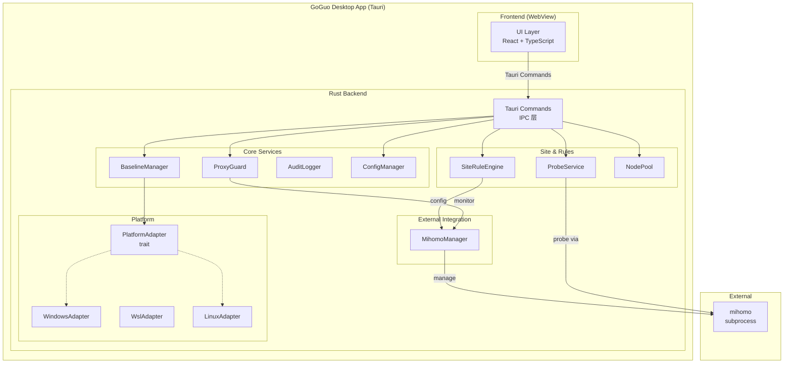
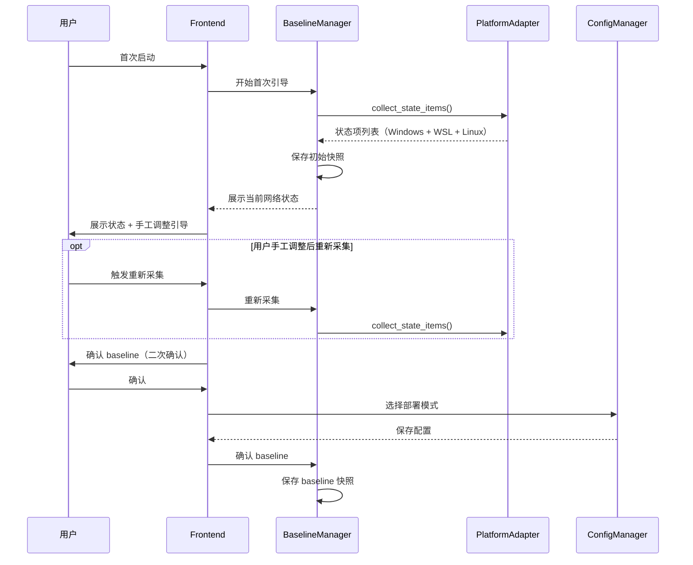
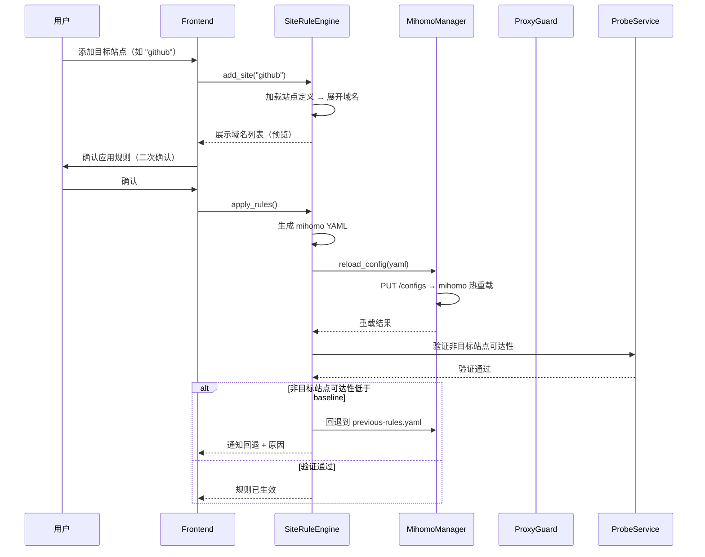
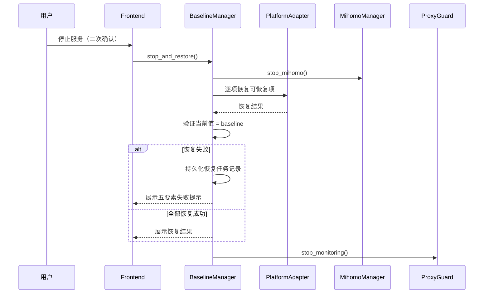

# GoGuo 架构概述

## 1. 系统目标与边界

GoGuo 是面向 PC 端 Windows + Linux/WSL 环境的本地网络可达性诊断、基线恢复与目标站点规则辅助工具。

**核心产品闭环**：安装后网络评估 → baseline 确认 → 目标站点配置 → 按站点生成代理规则 → 可达性持续诊断 → 网络切换自动恢复 → 停止服务恢复到 baseline。

**系统边界**：
- **内**：本地网络状态评估与恢复、目标站点代理规则生成与管理、mihomo 进程管理、跨平台 UI
- **外**：代理协议实现（委托 mihomo）、节点订阅获取（用户配置）、远程服务（不涉及）

## 2. 关键约束

| 约束 | 来源 |
|------|------|
| 默认 DIRECT + 目标 PROXY 策略，不采用全局代理模式 | Feature 003 CON-1 |
| 所有数据存储在安装根目录下统一数据目录，不上传远程 | Feature 001~004 共享 CON-5 |
| UI 不得向远程发起请求，全部数据来源于本地 API | Feature 004 CON-3 |
| 敏感操作（baseline 修改、规则应用、服务启停）必须二次确认 + 审计 | Feature 001/003 |
| 主路径操作不超过 2 步 | Feature 004 CON-4 |
| 桌面应用框架为 Tauri（Rust + WebView） | ADR-0002 |
| mihomo 作为托管子进程运行 | ADR-0003 |
| 跨平台策略为 Platform Adapter 模式 | ADR-0005 |

## 3. 主要模块 / 组件视图

### 模块职责

| 模块 | 职责 | 关联 Feature |
|------|------|-------------|
| **BaselineManager** | 初始快照采集、baseline 形成、对比、恢复 | 001 |
| **PlatformAdapter** | 平台特定的状态项读写抽象（Windows / WSL / Linux） | 001, 002 |
| **ProxyGuard** | mihomo 进程/端口/系统代理持续监控、异常恢复 | 001 |
| **AuditLogger** | 结构化审计日志（只追加）、五要素失败提示 | 001, 002, 003 |
| **ConfigManager** | 用户配置读写、部署组合管理 | 002, 003, 004 |
| **SiteRuleEngine** | 站点定义管理、规则生成、规则回退 | 003 |
| **ProbeService** | 目标站点可达性并行探测、诊断 | 003 |
| **NodePool** | 代理节点池管理、健康检查、退出机制 | 003 |
| **MihomoManager** | mihomo 进程生命周期管理、配置热重载 | 001, 003 |
| **UI Layer** | 用户交互界面（7 模块） | 004 |

## 4. 关键运行时交互

### 4.1 首次启动流程

### 4.2 目标站点规则应用

### 4.3 停止服务恢复流程

## 5. 关键非功能属性

| 属性 | 落地方式 |
|------|----------|
| **性能 — 冷启动 3s** | Tauri 轻量启动 + React code splitting + 首屏最小渲染（ADR-0006） |
| **性能 — 规则重载 5s** | mihomo 热重载 API + 异步验证（ADR-0003） |
| **性能 — 并行探测** | ProbeService 使用 tokio 并发任务，总耗时 ≤ 单站点 × 2（Feature 003 NFR-3.1-4） |
| **可靠性 — 恢复不丢** | write-to-temp + rename 原子写入；恢复任务记录持久化；续跑机制 |
| **可靠性 — 进程守护** | Proxy Guard 监控 mihomo 进程/端口/API，崩溃自动重启，连续失败阈值停止 |
| **安全 — 数据本地** | 全部数据文件式存储在安装根目录，无远程请求（ADR-0004） |
| **安全 — 敏感操作** | 二次确认机制 + 审计日志（五要素）+ OS 最小文件权限 |
| **可维护性 — 跨平台** | PlatformAdapter trait，新增平台只需实现接口（ADR-0005） |

## 6. 已知风险与技术债

| 风险 | 影响 | 概率 | 缓解 |
|------|------|------|------|
| Tauri WebView2/WebKitGTK 版本碎片化 | 跨平台 UI 一致性 | 中 | CI 矩阵构建 + 视觉回归测试 |
| mihomo 配置格式升级导致规则生成不兼容 | 规则应用失败 | 中 | 锁定 mihomo 版本；配置格式版本字段 |
| WSL 侧操作需 root 权限 | `/etc/resolv.conf` 等写入受限 | 高 | 降级为只读评估 + 用户引导（Feature 002 NFR-3.4-2） |
| 审计日志无限增长 | 磁盘空间 | 低 | 日志滚动策略 + 保留天数配置 |
| 站点定义数量增长（域名规则数） | mihomo 性能 | 低 | 分档验证：标准档 500 条（必须达标）、扩展档 1000 条（必须达标）、压力档 2000+（可接受轻微降级） |
| 现有 github-host 原型代码复用 | 需评估 DecisionEngine 可复用程度 | 中 | Feature 003 ASM-2 已标记低置信度 |

## 7. 术语表

| 术语 | 定义 |
|------|------|
| baseline | 经过评估和用户确认的可用网络状态快照，是恢复的目标 |
| 站点定义（Site Definition） | 一个逻辑站点的完整描述：`id` + `name` + `domains`（分类域名列表）+ 可选 `healthCheck` |
| PlatformAdapter | 跨平台状态项读写的抽象 trait，Windows、WSL、Linux 各有实现 |
| Proxy Guard | 持续监控 mihomo 进程/端口/系统代理一致性的守护机制 |
| 五要素失败提示 | 原因、已尝试动作、尝试次数、建议动作、是否需要手动处理 |
| 托管子进程 | GoGuo 负责生命周期管理的 mihomo 进程 |
| 部署组合 | 仅 Windows / 仅 WSL / 仅 Linux / 协同部署（Windows + WSL） |

## 8. ADR 索引

| ADR | 标题 | 状态 |
|-----|------|------|
| [0001](docs/adr/0001-record-architecture-decisions.md) | 建立架构决策记录机制 | accepted |
| [0002](docs/adr/0002-tauri-desktop-framework.md) | Desktop App Framework — Tauri | accepted |
| [0003](docs/adr/0003-mihomo-subprocess-integration.md) | mihomo 集成架构 — 托管子进程 | accepted |
| [0004](docs/adr/0004-file-based-json-storage.md) | 数据存储策略 — 安装根目录下文件式 JSON | accepted |
| [0005](docs/adr/0005-platform-adapter-pattern.md) | 跨平台策略 — Platform Adapter 模式 | accepted |
| [0006](docs/adr/0006-react-frontend-framework.md) | 前端框架选型 — React + TypeScript | accepted |
