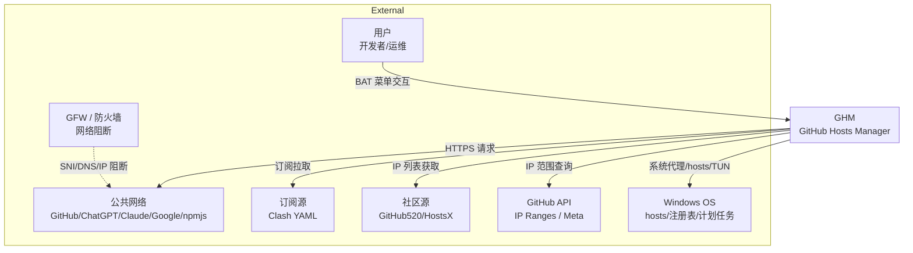
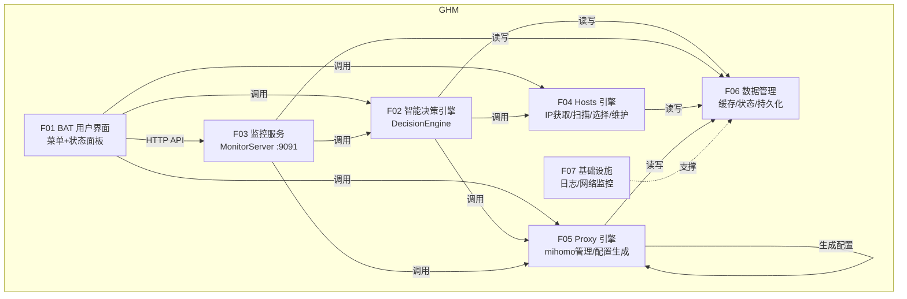
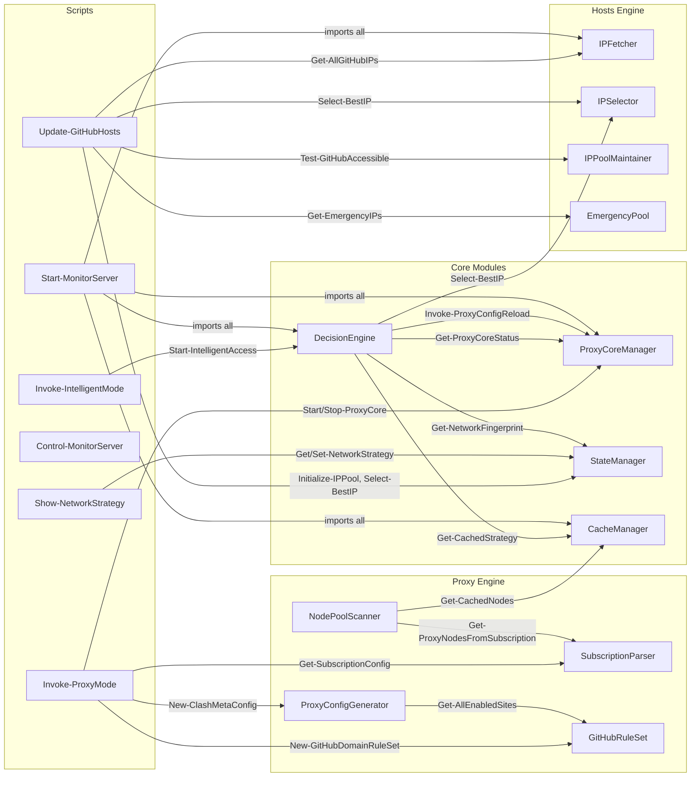

# GitHub Hosts Manager — 应用架构：功能视图 L0-L4

> **版本**: v2.0 | **日期**: 2026-04-25
> **范围**: arch.md §2 (AA) 的细化，多层级功能视图
> **关联**: arch.md §2, arch-BA.md (用例映射)

---

## L0 — 系统上下文视图（本项目为黑盒）



**L0 说明**: GHM 是一个 Windows 桌面工具，通过修改系统 hosts 文件、配置系统代理或 TUN 模式，帮助用户绕过网络阻断访问 GitHub 等站点。

---

## L1 — 系统展开视图（打开黑盒）



| 编号 | 组件 | 职责 | 关键代码载体 |
|------|------|------|-------------|
| F01 | BAT 用户界面 | 9 主菜单 + 子菜单，状态面板渲染 | `GitHub-Hosts-Manager.bat` + `scripts/*.ps1` |
| F02 | 智能决策引擎 | 网络检测→三路探测→评分→模式选择→执行 | `modules/DecisionEngine.psm1` |
| F03 | 监控服务 | REST API + Watchdog + 自动恢复 + 缓存管理 | `modules/MonitorServer.psm1` |
| F04 | Hosts 引擎 | IP 获取/扫描/选择/维护/社区源/紧急池 | `modules/IP*.psm1` + `CommunitySource` + `EmergencyPool` |
| F05 | Proxy 引擎 | mihomo 生命周期/配置生成/订阅解析/节点池 | `modules/Proxy*.psm1` + `SubscriptionParser` + `NodePoolScanner` |
| F06 | 数据管理 | 4 层缓存/原子写入/状态持久化 | `modules/CacheManager.psm1` + `StateManager.psm1` |
| F07 | 基础设施 | 日志/网络事件监听 | `modules/Logger.psm1` + `NetworkMonitor.psm1` |

---

## L2 — 组件模块展开

### F01 BAT 用户界面

| 编号 | 模块 | 职责 | 代码载体 |
|------|------|------|----------|
| F01-01 | 状态面板 | 读取 JSON + 实时探测渲染 7 行面板 | `scripts/Render-StatusPanel.ps1` |
| F01-02 | 一键访问入口 | 调用 DecisionEngine 全流程 | `scripts/Invoke-IntelligentMode.ps1` |
| F01-03 | Hosts 更新 | 调用 Hosts 引擎全流程 | `scripts/Update-GitHubHosts.ps1` |
| F01-04 | 代理模式控制 | 启停/配置代理核心 | `scripts/Invoke-ProxyMode.ps1` |
| F01-05 | 监控服务控制 | 启停/重启 MonitorServer | `scripts/Control-MonitorServer.ps1` |
| F01-06 | 连通性探测 | 轻量 GitHub 可达性探测 | `scripts/Invoke-GitHubProbeLite.ps1` |
| F01-07 | 节点展示 | 节点列表 + 测速 | `scripts/Show-NodeList.ps1` + `Invoke-SpeedTest.ps1` |
| F01-08 | 策略管理 | 查看/编辑网络策略 | `scripts/Show-NetworkStrategy.ps1` |
| F01-09 | 诊断展示 | 连通性/恢复/网络/IP 池/网络环境 | `scripts/Show-GitHubConnectivity.ps1` 等 |
| F01-10 | 历史展示 | 日志/访问历史/决策历史 | `scripts/Show-AccessHistory.ps1` |
| F01-11 | 计划任务 | 安装/卸载 Windows 计划任务 | `scripts/Install-GitHubHostsUpdate.ps1` |

### F02 智能决策引擎

| 编号 | 模块 | 职责 |
|------|------|------|
| F02-01 | 网络环境检测 | 网关 IP→类型分类 + ISP + SSID + 网络指纹 |
| F02-02 | 三路探测 | Direct TCP / Hosts IP / Proxy API 并行探测 |
| F02-03 | 评分算法 | 可达性(100) + 延迟(0-50) + 网络类型加成 + 历史加成 |
| F02-04 | 策略路由 | 查询 network-strategies.json → 首选/备选/保底 |
| F02-05 | 模式执行 | Invoke-HostsMethod / Invoke-ProxyMethod / 无操作 |
| F02-06 | 网络变更监控 | WMI 事件 + 30s 轮询 → 策略重评估 |

**依赖**: F06(StateManager) + F04(IPSelector) + F07(NetworkMonitor) + F05(ProxyCoreManager) + F05(SubscriptionParser) + F05(ProxyConfigGenerator)

### F03 监控服务

| 编号 | 模块 | 职责 |
|------|------|------|
| F03-01 | REST API | 17+ 端点 (health/status/switch/pool/sources/ha) |
| F03-02 | Watchdog | 4 项定时任务 (network/github/node/ip) |
| F03-03 | GitHub 探测 | TCP + HTTPS 双层，15s 周期 |
| F03-04 | 自动恢复 | 5 阶段升级链 (HA→候选→缓存→外部→退避→告警) |
| F03-05 | 缓存管理 | 4 层缓存 + 评分衰减 + 原子持久化 |
| F03-06 | 状态文本输出 | Write-StatusTextFile → CMD type 读取 |
| F03-07 | 节点池扫描 | 定时全量/快检 + 紧急发现 |
| F03-08 | 主备切换 | Primary/Standby mihomo 角色切换 (planning) |

**依赖**: F02(DecisionEngine) + F06(CacheManager) + F05(NodePoolScanner) + F05(ProxyConfigGenerator) + F05(ProxyCoreManager)

### F04 Hosts 引擎

| 编号 | 模块 | 职责 | 代码载体 |
|------|------|------|----------|
| F04-01 | IP 获取器 | 多源 IP 获取 (内置池/社区/GitHub520/DNS) | `modules/IPFetcher.psm1` |
| F04-02 | IP 扫描器 | TCP/HTTP 并行扫描 + 延迟测量 | `modules/IPScanner.psm1` |
| F04-03 | IP 选择器 | 评分排序 + 三阶段测试 (ICMP/TCP/HTTPS) | `modules/IPSelector.psm1` |
| F04-04 | IP 池维护 | 状态机驱动的池生命周期管理 | `modules/IPPoolMaintainer.psm1` |
| F04-05 | IP 范围统计 | /24 段质量追踪 + 优先扫描 | `modules/IPRangeStats.psm1` |
| F04-06 | 社区源 | GitHub520/HostsX 格式解析 | `modules/CommunitySource.psm1` |
| F04-07 | 紧急池 | 硬编码备用 IP (最后手段) | `modules/EmergencyPool.psm1` |

**依赖链**: F04-01 → F06(StateManager) + F04-06(CommunitySource); F04-03 → F06 + F04-01; F04-02 → F06 + F04-03 + F04-05; F04-04 → F06 + F04-01 + F04-03 + F06(CacheManager)

### F05 Proxy 引擎

| 编号 | 模块 | 职责 | 代码载体 |
|------|------|------|----------|
| F05-01 | 代理核心管理 | mihomo 进程生命周期 + 系统代理 + HA | `modules/ProxyCoreManager.psm1` |
| F05-02 | 配置生成器 | mihomo YAML 生成 (DNS/代理组/规则/TUN) | `modules/ProxyConfigGenerator.psm1` |
| F05-03 | 订阅解析 | Clash YAML/Base64/URI 解析 | `modules/SubscriptionParser.psm1` |
| F05-04 | 站点规则集 | 域名管理 + IP 范围 + rule-provider YAML | `modules/GitHubRuleSet.psm1` |
| F05-05 | 节点池扫描 | 源管理 + TCP 快筛 + mihomo 精测 + 优先级 | `modules/NodePoolScanner.psm1` |

**依赖链**: F05-02 → F05-04; F05-05 → F06(CacheManager) + F05-03; F05-01 (独立)

### F06 数据管理

| 编号 | 模块 | 职责 | 代码载体 |
|------|------|------|----------|
| F06-01 | 缓存管理 | 4 层缓存 + LRU 淘汰 + 评分衰减 | `modules/CacheManager.psm1` |
| F06-02 | 状态管理 | 网络指纹 + DPAPI + proxy-state.json | `modules/StateManager.psm1` |

### F07 基础设施

| 编号 | 模块 | 职责 | 代码载体 |
|------|------|------|----------|
| F07-01 | 日志 | 分级日志 + 文件轮转 + 专用日志函数 | `modules/Logger.psm1` |
| F07-02 | 网络监控 | WMI 适配器事件 + 去抖动 | `modules/NetworkMonitor.psm1` |

---

## L2 接口调用关系图



---

## L3 — 关键模块函数级展开

### DecisionEngine (F02) 导出函数

| 函数 | 参数 | 返回 | 职责 |
|------|------|------|------|
| `Get-NetworkEnvironment` | `[-Force]` | `{type, gateway, isp, ssid, networkId}` | 网关 IP→类型分类 + ISP + SSID |
| `Test-ConnectionAvailability` | `[-Targets @('github.com')]` | `{direct, hosts, proxy}` 各含 `{reachable, latency}` | 三路并行探测 |
| `Resolve-ConnectionPlan` | `$env, $avail` | `{method, confidence, reason, scores}` | 评分选最优方案 |
| `Invoke-HostsMethod` | 无 | `{success, latency}` | 写 hosts + 刷新 DNS |
| `Invoke-ProxyMethod` | `[-RequiresStartup]` | `{success, node, latency}` | 启动 mihomo + 设系统代理 |
| `Start-IntelligentAccess` | `[-Target 'github.com']` | 执行结果 | 完整决策→执行→监控入口 |
| `Start-NetworkChangeMonitor` | 无 | Job | 启动后台网络变更监控 |
| `Stop-NetworkChangeMonitor` | 无 | void | 停止监控 |

### ProxyCoreManager (F05-01) 导出函数

| 函数 | 职责 |
|------|------|
| `Start-ProxyCore` / `Stop-ProxyCore` | mihomo 进程生命周期 |
| `Get-ProxyCoreStatus` | 读取 proxy-state.json 返回运行状态 |
| `Set-SystemProxy` / `Restore-SystemProxy` | Windows 注册表代理设置 |
| `Invoke-ProxyConfigReload` | mihomo API PUT /configs 热重载 |
| `Start-PrimaryCore` / `Start-StandbyCore` | 主备实例管理 |
| `Switch-ActiveCore` | HA 角色切换 |
| `Set-TunMode` | TUN 模式开关 |
| `Remove-GitHubHostsEntries` | 清理 hosts 文件 |

### MonitorServer (F03) 关键内部函数

| 函数 | 职责 |
|------|------|
| `Start-MonitorServer` | HttpListener 主循环 + Watchdog |
| `Invoke-GitHubProbe` | TCP + HTTPS 双层 GitHub 探测 |
| `Invoke-AutoRecovery` | 5 阶段恢复升级链 |
| `Invoke-HAFailover` | 主备切换 |
| `Write-StatusTextFile` | 纯文本状态输出 |
| REST handlers | 17+ API 端点处理 |

### CacheManager (F06-01) 导出函数

| 函数 | 职责 |
|------|------|
| `Initialize-Cache` | 初始化 4 层缓存结构 |
| `Get-CachedNodes` / `Get-CachedIPs` | 读取缓存 |
| `Get-TopCandidates` | 按有效评分排序取 Top N |
| `Update-NodeCache` / `Update-IPCache` | 更新缓存 + 评分衰减 |
| `Save-CacheToDisk` | 持久化到 JSON |
| `Write-JsonAtomic` | temp + Move-Item 原子写入 |

---

## L4 — 节点池扫描状态机 (IPPoolMaintainer)

```
                    ┌──────────┐
          ┌────────►│ HEALTHY  │◄────────┐
          │         │ (日常维护) │          │
          │         └────┬─────┘          │
          │              │ IP数 < 阈值      │ 恢复成功
          │              ▼                │
          │         ┌──────────┐          │
          │         │ WARNING  │──────────┘
          │         │ (增强维护) │
          │         └────┬─────┘
          │              │ IP数继续下降
          │              ▼
          │         ┌──────────┐
          │         │ EMERGENCY│
          │         │ (紧急维护) │
          │         └────┬─────┘
          │              │ 获得新 IP
          │              ▼
          │         ┌──────────┐
          └─────────│ RECOVERY │
                    │ (恢复验证) │
                    └──────────┘
```

---

## 模块依赖层级汇总

```
Layer 0 (无依赖):
  Logger · NetworkMonitor · StateManager · SubscriptionParser
  CacheManager · ProxyCoreManager · GitHubRuleSet

Layer 1 (依赖 Layer 0):
  CommunitySource → StateManager
  IPFetcher → StateManager, CommunitySource
  IPSelector → StateManager, IPFetcher
  IPRangeStats → CacheManager
  EmergencyPool → Logger, IPSelector
  ProxyConfigGenerator → GitHubRuleSet
  NodePoolScanner → CacheManager, SubscriptionParser

Layer 2 (依赖 Layer 0+1):
  IPScanner → StateManager, IPSelector, IPRangeStats
  IPPoolMaintainer → StateManager, IPFetcher, IPSelector, CacheManager

Layer 3 (依赖 Layer 0+1+2):
  DecisionEngine → Logger, StateManager, IPSelector, NetworkMonitor,
                    ProxyCoreManager, SubscriptionParser, ProxyConfigGenerator
  MonitorServer → Logger, CacheManager, DecisionEngine, NodePoolScanner,
                   ProxyConfigGenerator, ProxyCoreManager
```

---

## 代码规模统计

| 模块 | 行数 | 函数数 | 内部依赖数 |
|------|------|--------|-----------|
| MonitorServer | 3193 | 94 | 6 |
| IPPoolMaintainer | 2174 | 25 | 4 |
| IPSelector | 1619 | 13 | 2 |
| IPFetcher | 1416 | 14 | 2 |
| NodePoolScanner | 1339 | 29 | 2 |
| ProxyCoreManager | 1001 | 27 | 0 |
| StateManager | 1019 | 20 | 0 |
| CacheManager | 951 | 17 | 0 |
| DecisionEngine | 933 | 17 | 7 |
| SubscriptionParser | 638 | 15 | 0 |
| CommunitySource | 619 | 8 | 1 |
| EmergencyPool | 596 | 10 | 2 |
| IPScanner | 573 | 6 | 3 |
| ProxyConfigGenerator | 669 | 11 | 1 |
| IPRangeStats | 471 | 8 | 1 |
| GitHubRuleSet | 424 | 11 | 0 |
| Logger | 293 | 10 | 0 |
| NetworkMonitor | 257 | 6 | 0 |
| **合计** | **18,185** | **321** | — |
