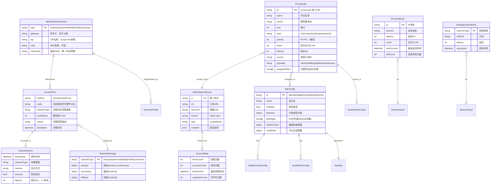
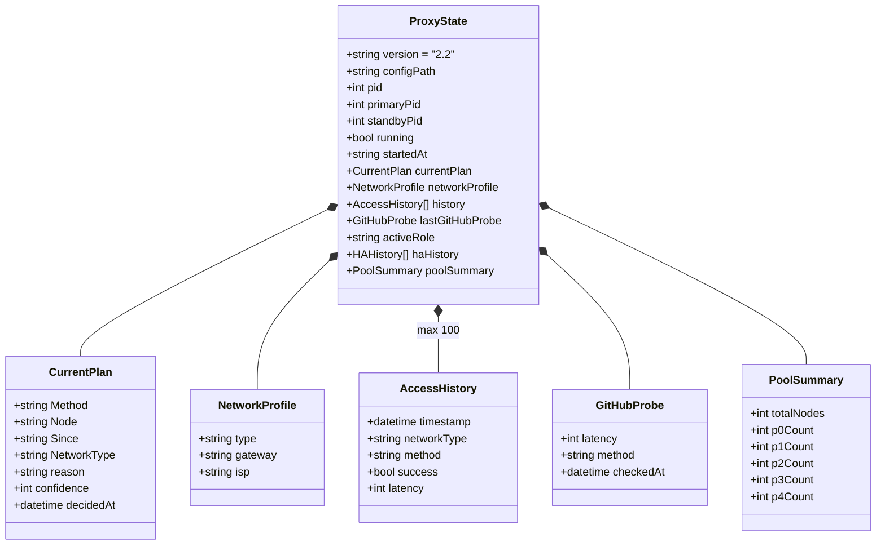
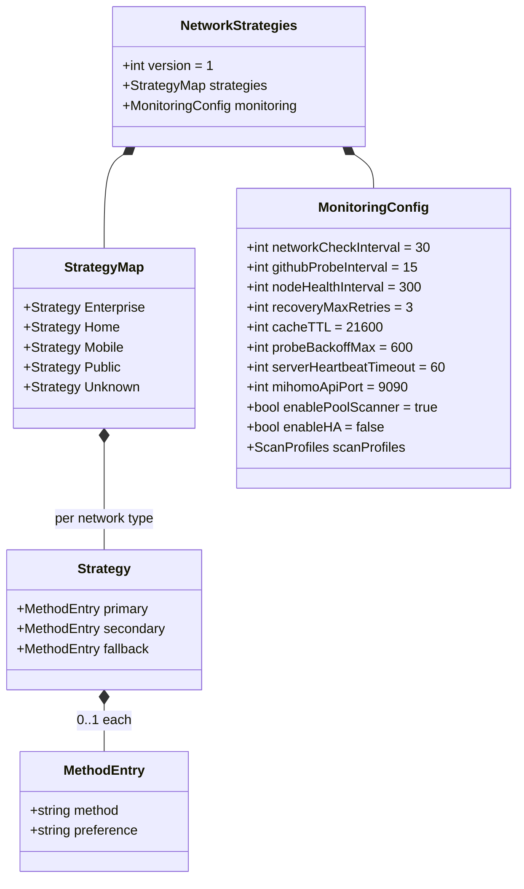
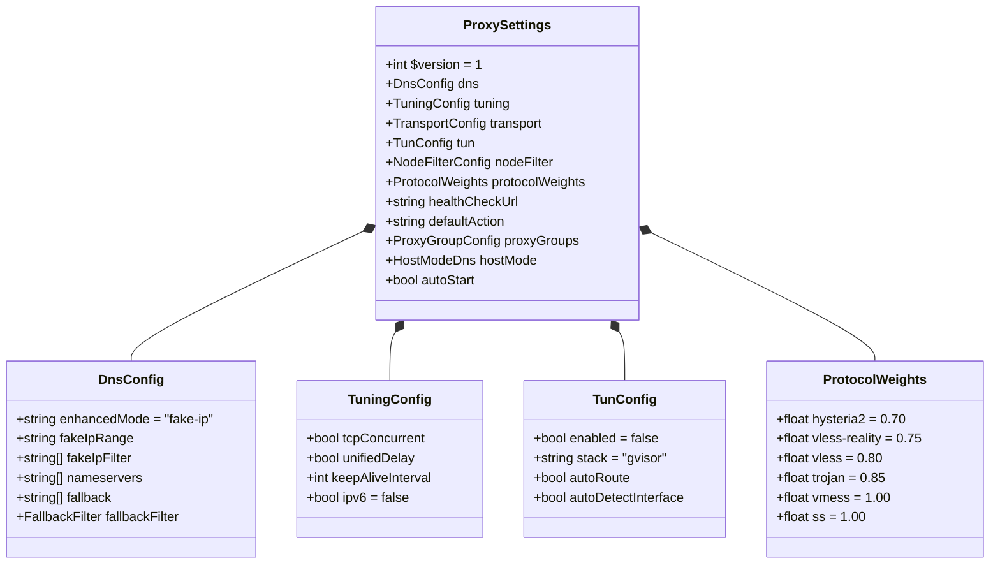
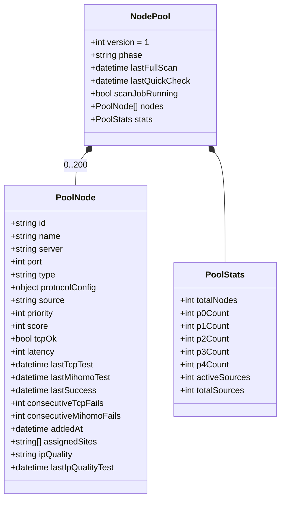

# GitHub Hosts Manager — 数据架构：概要与逻辑模型

> **版本**: v2.0 | **日期**: 2026-04-25
> **范围**: arch.md §3 (DA) 的细化，面向对象数据模型
> **关联**: arch.md §3, arch-AA.md (模块依赖)

---

## 1. 概要数据模型

---

## 2. 逻辑数据模型 — proxy-state.json

**存储位置**: `data/proxy-state.json`
**写入者**: ProxyCoreManager, DecisionEngine, MonitorServer
**写入频率**: 高 (模式切换/恢复时)
**原子性**: 通过 Write-JsonAtomic 保证

**字段约束与规则**:

| 字段 | 类型 | 约束 | 规则 |
|------|------|------|------|
| `version` | string | "2.3" (Stop-ProxyCore 路径仍为 "2.2") | 向后兼容：读取时 switch version 做迁移 |
| `pid` | int | ≥ 0 | 0=未运行；写入时同时写 proxy-core.pid |
| `running` | bool | — | 与 pid > 0 一致性约束；读取时交叉验证进程存活 |
| `currentPlan.Method` | string | "Direct"\|"Hosts"\|"Proxy" | 模式切换时原子更新 |
| `currentPlan.confidence` | int | 0-100 | 评分算法输出，影响 UI 展示 |
| `history[]` | array | ≤ 100 条 | FIFO 截断，写入时 Check-Remove excess |
| `activeRole` | string | "primary"\|"standby" | HA 模式下有效，非 HA 时固定 "primary" |
| `poolSummary` | object | 可为 null | MonitorServer 周期性更新，不从持久化恢复 |

---

## 3. 逻辑数据模型 — config/sites/{id}.json

**存储位置**: `config/sites/github.json`, `chatgpt.json`, `claude.json`, `google.json`, `npmjs.json`
**写入者**: GitHubRuleSet (更新域名), BAT 菜单 4.9 (toggle enabled)
**读取者**: ProxyConfigGenerator, GitHubRuleSet, MonitorServer (healthCheck)

```mermaid
classDiagram
    class SiteConfig {
        +int $version = 1
        +string id
        +string name
        +bool enabled
        +string description
        +DomainMap domains
        +string[] ipRanges
        +HealthCheck healthCheck
        +NodeFilter nodeFilter
    }

    class DomainMap {
        +string[] core
        +string[] api
        +string[] assets
        +string[] services
        +string[] cdn
        +string[] thirdparty
        +string[] copilot
        +string[] codespaces
        +string[] packages
        +string[] git
        +string[] auth
        +string[] analytics
        +string[] crossDependency
    }

    class HealthCheck {
        +string url
        +int tolerance
    }

    class NodeFilter {
        +int minPriority
        +int maxLatency
        +string[] ipQuality
        +string[] preferredProtocols
        +bool requireIpQuality
    }

    SiteConfig *-- DomainMap
    SiteConfig *-- HealthCheck : nullable
    SiteConfig *-- NodeFilter : nullable
```

**字段约束与规则**:

| 字段 | 约束 | 规则 | 关联 |
|------|------|------|------|
| `id` | 唯一，小写 | 文件名必须为 `{id}.json`；作为 proxy group 名和 rule-provider key | ProxyConfigGenerator 读取生成配置 |
| `enabled` | bool | `false` 时 ProxyConfigGenerator 跳过该站点；BAT 4.9 可切换 | 切换后需 POST /api/restart 重载 |
| `domains` | 至少一个分类非空 | 所有分类合并后生成 `config/ruleset/github.yaml` 中的规则 | 每个域名生成一条 DOMAIN-SUFFIX 规则 |
| `ipRanges` | CIDR 格式 | 仅 GitHub 有值；用于生成 `config/ruleset/github-ip.yaml` | 非空时生成 IP-CIDR 规则 |
| `healthCheck.url` | 可为 null | null 时 fallback 到 `proxy-settings.json` 的 `healthCheckUrl`（默认 `http://github.com`） | ProxyConfigGenerator 用作 per-site url-test 的检查 URL |
| `healthCheck.tolerance` | int, ms | 同组节点延迟差 < tolerance 不切换 | 影响节点选择稳定性 |
| `nodeFilter.minPriority` | 0-4 | 候选节点优先级 ≤ 此值才分配给该站点 | NodePoolScanner 分配逻辑 |
| `nodeFilter.maxLatency` | ms | 候选节点延迟 > 此值排除 | 节点分配硬约束 |
| `nodeFilter.ipQuality` | string[] | 允许的 IP 质量等级 | ChatGPT/Claude 要求 `clean`，Google 允许 `challenged` |
| `nodeFilter.requireIpQuality` | bool | `true` 时无 IP 质量数据的节点排除 | ChatGPT/Claude 为 true |

**当前 5 站点配置差异**:

| 站点 | 域名数 | ipRanges | healthCheck | nodeFilter | 特殊约束 |
|------|--------|----------|-------------|------------|----------|
| github | 47 | 3 段 | null (fallback) | 无 | 唯一有 IP 范围的站点 |
| chatgpt | 22 | 空 | `https://chatgpt.com` T=150 | P1/500ms/clean/required | 含 Cloudflare 第三方域名 |
| claude | 15 | 空 | `https://claude.ai` T=150 | P1/500ms/clean/required | 含 Google 跨依赖域名 |
| google | 22 | 空 | `/generate_204` T=100 | P2/800ms/not-required | 含 YouTube/Gmail/学术 |
| npmjs | 3 | 空 | `registry.npmjs.org` T=100 | P2/2000ms/not-required | 域名最少，容许高延迟 |

---

## 4. 逻辑数据模型 — data/network-strategies.json

**存储位置**: `data/network-strategies.json`
**写入者**: UC3g (Edit-NetworkStrategy), 初始安装
**读取者**: DecisionEngine, MonitorServer

**字段约束与规则**:

| 字段 | 约束 | 规则 |
|------|------|------|
| `strategies.*.primary.method` | 必填 | 不能为 null；有效值: Hosts/Direct/Proxy/Auto |
| `strategies.*.secondary` | 可 null | Public 类型固定为 null |
| `strategies.*.fallback` | 可 null | Public 类型固定为 null |
| `primary.preference` | 仅 Proxy 时有效 | "vless"/"hysteria2"，影响协议优先级权重 |
| `monitoring.networkCheckInterval` | ≥ 5s | Watchdog 网关检查周期 |
| `monitoring.githubProbeInterval` | ≥ 5s | Watchdog GitHub 探测周期 |
| `monitoring.recoveryMaxRetries` | ≥ 1 | 自动恢复最大尝试次数 |
| `monitoring.probeBackoffMax` | ≥ 30s | 探测退避上限 (30→60→120→300→max) |
| `scanProfiles.{type}` | 可覆盖 defaults | 每种网络类型可自定义扫描超时/并发数 |

---

## 5. 逻辑数据模型 — config/proxy-settings.json

**存储位置**: `config/proxy-settings.json`
**写入者**: BAT 4.T (Transport Mode), 3.8.5 (Auto-start)
**读取者**: ProxyConfigGenerator

**关键约束**:

| 字段 | 约束 | 规则 |
|------|------|------|
| `dns.nameservers` | 国内 DNS | 223.5.5.5/119.29.29.29，确保国内域名正常解析 |
| `dns.fallback` | 国内 DoH | dns.alidns.com/doh.pub；fake-ip 模式下非 CN 域名走 fallback |
| `dns.fallbackFilter.geoip` | true + CN | CN 域名不触发 fallback，避免国内域名被代理 |
| `tun.enabled` | 默认 false | 开启需管理员权限；开启后所有 TCP/UDP 经 mihomo |
| `tuning.ipv6` | 默认 false | 禁用简化部署，大多数中国家庭网络 IPv6 不稳定 |
| `protocolWeights` | 0.70-1.00 | 值越低优先级越高；hysteria2(0.70) > vless-reality(0.75) > vmess(1.00) |
| `healthCheckUrl` | 全局默认 | 当 site.healthCheck 为 null 时使用 |

---

## 6. 逻辑数据模型 — data/cache/node-pool.json

**存储位置**: `data/cache/node-pool.json`
**写入者**: NodePoolScanner, MonitorServer
**读取者**: MonitorServer, BAT 4.5/4.9

**字段约束与规则**:

| 字段 | 约束 | 规则 |
|------|------|------|
| `phase` | "bootstrap"\|"steady"\|"degraded"\|"emergency" | bootstrap→首次扫描完成→steady；节点不足→degraded→emergency |
| `nodes[]` | max 200 | 超限时驱逐 P4 和低分 P3 节点 |
| `priority` | 0-4 | P0=最优(<100ms), P1=优(<300ms), P2=良(<500ms), P3=可用(<1000ms), P4=死亡 |
| `consecutiveTcpFails` | ≥ 0 | ≥ 3 → 降级到 P4 |
| `consecutiveMihomoFails` | ≥ 0 | ≥ 2 → 降级到 P4 |
| `assignedSites` | string[] | 节点可分配给 0-N 个站点；空=通用节点 |
| `ipQuality` | "clean"\|"challenged"\|"blocked"\|"unknown" | ChatGPT/Claude 要求 clean；blocked 节点不分配给任何站点 |
| `stats.*Count` | — | 各优先级计数，与 nodes[] 实际一致 |

---

## 7. 数据一致性约束汇总

| 约束 | 规则 | 实施位置 |
|------|------|----------|
| 原子写入 | temp + Move-Item -Force | CacheManager.Write-JsonAtomic |
| 版本迁移 | version 字段 + switch 兼容 | DecisionEngine 读取 proxy-state.json |
| 缺失降级 | 配置缺失 → 内嵌默认值 + Warning | 各模块 `$script:Default*` |
| 损坏隔离 | 单文件 JSON 错误 → Warning 不崩溃 | ConvertFrom-Json + try/catch |
| 历史截断 | history 数组 ≤ 100 条 | ProxyCoreManager 写入时截断 |
| 缓存淘汰 | 节点健康 ≤ 100 条 (LRU) | CacheManager.$script:MaxNodes |
| 评分衰减 | 缓存数据按时间衰减权重 | CacheManager 读取时计算 |
| 引用完整性 | site.id = proxy group name = rule-provider key | ProxyConfigGenerator 生成时强制一致 |
| 文件-代码同步 | healthCheck null → fallback 全局默认值 | ProxyConfigGenerator:518-523 |
