# GitHub Hosts Manager — 技术架构：部署模型、时序图与状态机

> **版本**: v2.0 | **日期**: 2026-04-25
> **范围**: arch.md §4 (TA) 的细化，运行时技术视图
> **关联**: arch.md §4, arch-AA.md (模块依赖), arch-DA.md (数据模型)

---

## 1. 部署清单

### 1.1 运行时组件

| 组件 | 二进制/脚本 | 端口 | 进程类型 | 生命周期 |
|------|------------|------|----------|----------|
| mihomo Primary | `core/mihomo.exe` | :7890(mixed) :7891(SOCKS) :9090(API) | 独立进程 | ProxyCoreManager 管理 |
| mihomo Standby | `core/mihomo.exe` | :7892(mixed) :9092(API) | 独立进程 | HA 模式，热备 |
| MonitorServer | PowerShell + HttpListener | :9091(API) | 后台 PowerShell 进程 | Control-MonitorServer.ps1 管理 |
| BAT 主进程 | CMD (`GitHub-Hosts-Manager.bat`) | 无 | 前台交互进程 | 用户手动启动 |

### 1.2 配置文件清单

| 文件 | 类型 | 写入者 | 说明 |
|------|------|--------|------|
| `config/proxy-settings.json` | 静态配置 | BAT 4.T / 3.8.5 | DNS/TUN/协议权重/传输 |
| `config/proxy-config.yaml` | 生成配置 | ProxyConfigGenerator | mihomo 运行时配置 |
| `config/sites/{id}.json` | 静态配置 | GitHubRuleSet / BAT 4.9 | 5 站点域名+健康检查+过滤 |
| `config/ruleset/{site}.yaml` | 生成配置 | GitHubRuleSet | mihomo rule-provider |
| `config/ruleset/{site}-ip.yaml` | 生成配置 | GitHubRuleSet | IP-CIDR 规则 (仅 GitHub) |
| `data/network-strategies.json` | 静态配置 | UC3g | 网络策略+监控参数 |
| `data/subscriptions.json` | 静态配置 (遗留) | BAT 4.2 | 订阅源 URL + DPAPI 加密 (被 SubscriptionParser 使用) |
| `config/subscription-sources.json` | 静态配置 (新) | BAT 4.2 | 订阅源注册表 (被 NodePoolScanner 使用) |

### 1.3 状态文件清单

| 文件 | 写入频率 | 写入者 | 说明 |
|------|----------|--------|------|
| `data/proxy-state.json` | 高 (模式切换) | ProxyCoreManager / MonitorServer | PID/模式/网络/历史 |
| `data/cache/node-pool.json` | 中 (扫描周期) | NodePoolScanner / MonitorServer | 节点池+优先级+评分 |
| `data/monitor-status.json` | 高 (5s 心跳) | MonitorServer | 运行状态+Watchdog 结果 |
| `data/monitor-status.txt` | 高 (状态变更) | MonitorServer | 纯文本状态面板 (CMD type 读取) |
| `data/monitor-server.pid` | 低 (启停) | MonitorServer | 进程 PID |
| `data/proxy-core.pid` | 低 (启停) | ProxyCoreManager | mihomo PID |
| `%TEMP%/ip_pool_maintenance_state.json` | 中 | IPPoolMaintainer | 状态机持久化 |

### 1.4 系统资源依赖

| 资源 | 路径/命令 | 权限要求 | 用途 |
|------|----------|----------|------|
| hosts 文件 | `%SystemRoot%\System32\drivers\etc\hosts` | 管理员 | Hosts 模式 IP 映射 |
| 系统代理注册表 | `HKCU:\...\Internet Settings` | 用户级 | ProxyEnable/ProxyServer |
| 计划任务 | `schtasks` | 管理员 | 定时更新 hosts |
| 防火墙规则 | `netsh advfirewall` | 管理员 | mihomo 端口放行 |
| DNS 刷新 | `ipconfig /flushdns` | 用户级 | hosts/代理切换后生效 |

---

## 2. 功能模块在进程中的部署

### 2.1 进程-模块部署图

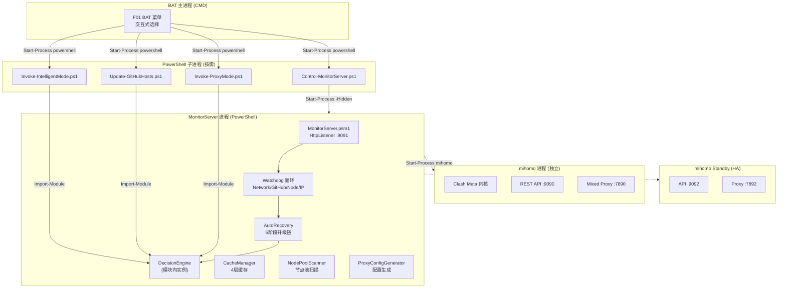

### 2.2 模块在进程中的分布矩阵

| 模块 | BAT 进程 | PS 脚本子进程 | MonitorServer 进程 | mihomo 进程 |
|------|----------|--------------|-------------------|-------------|
| DecisionEngine | — | Import | Import | — |
| ProxyCoreManager | — | Import | Import | — |
| CacheManager | — | — | Import | — |
| NodePoolScanner | — | — | Import | — |
| ProxyConfigGenerator | — | Import | Import | — |
| SubscriptionParser | — | Import | Import | — |
| GitHubRuleSet | — | Import | Import | — |
| IPFetcher | — | Import | Import | — |
| IPSelector | — | Import | — | — |
| IPScanner | — | Import | — | — |
| IPPoolMaintainer | — | Import | — | — |
| StateManager | — | Import | Import | — |
| NetworkMonitor | — | Import | Import | — |
| Logger | — | Import | Import | — |
| MonitorServer | — | — | **宿主** | — |

**关键说明**:
- MonitorServer 是模块聚合度最高的进程，Import 了 14 个模块
- PS 脚本子进程按需启动，执行完毕退出，无持久状态
- mihomo 是独立二进制进程，仅通过 REST API (`:9090`) 被外部操控
- 同一模块在不同进程中各自 Import，内存状态独立（通过 JSON 文件共享状态）

---

## 3. 数据模型在配置/存储中的映射

### 3.1 数据流向图

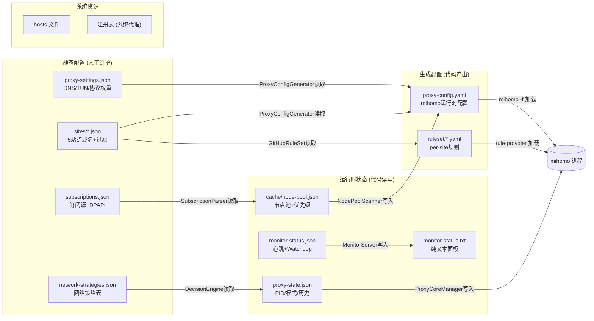

### 3.2 配置到运行时映射表

| 概念模型实体 | 配置文件 | 运行时载体 | 读取者 | 写入者 |
|-------------|---------|-----------|--------|--------|
| NetworkEnvironment | — | proxy-state.json.networkProfile | DecisionEngine | MonitorServer |
| AccessPlan | network-strategies.json | proxy-state.json.currentPlan | MonitorServer | DecisionEngine |
| AccessHistory | — | proxy-state.json.history[] | DecisionEngine | MonitorServer |
| ProxyNode | subscriptions.json → 解析 | cache/node-pool.json.nodes[] | NodePoolScanner | NodePoolScanner |
| SiteConfig | config/sites/{id}.json | 内存对象 | ProxyConfigGenerator | GitHubRuleSet / BAT 4.9 |
| SubscriptionSource | subscriptions.json | 内存对象 | SubscriptionParser | BAT 4.2 |
| IPCacheEntry | — | cache/ip-*.json | IPSelector | IPFetcher / IPScanner |
| StrategyCacheEntry | — | cache/strategy-*.json | DecisionEngine | MonitorServer |
| NetworkStrategy | network-strategies.json | 内存对象 | DecisionEngine | UC3g |
| ProxySettings | proxy-settings.json | 内存对象 | ProxyConfigGenerator | BAT 4.T |

---

## 4. 主要场景运行时序图

### 4.1 UC1 智能访问（正常流程）

```mermaid
sequenceDiagram
    actor User
    participant BAT as BAT 主进程
    participant PS as PowerShell 子进程
    participant DE as DecisionEngine
    participant SM as StateManager
    participant PCM as ProxyCoreManager
    participant MI as mihomo API

    User->>BAT: 按键 "1"
    BAT->>PS: Start-Process powershell<br/>-File Invoke-IntelligentMode.ps1
    PS->>DE: Start-IntelligentAccess

    Note over DE: Step 1: 网络检测
    DE->>SM: Get-NetworkFingerprint
    SM-->>DE: {type:Home, gateway, isp}

    Note over DE: Step 2: 三路并行探测
    par Direct 探测
        DE->>DE: Test-DirectTcpConnection<br/>github.com:443
    and Hosts 探测
        DE->>SM: Get-TopIPs(domain, count=5)
        SM-->>DE: [IP列表]
        DE->>DE: Test-DirectTcpConnection<br/>每个 IP
    and Proxy 探测
        DE->>PCM: Get-ProxyCoreStatus
        PCM-->>DE: {running:true, pid:1234}
        DE->>MI: GET /proxies/GitHub/delay
        MI-->>DE: {delay:245}
    end

    Note over DE: Step 3: 评分决策
    DE->>DE: Resolve-ConnectionPlan
    Note over DE: Direct: +10 +100(可达) +30(&lt;200ms)<br/>Hosts: +5 +100 +50(&lt;100ms)<br/>Proxy: +10(Home加成) +100 +10

    alt 选中 Proxy 模式
        DE->>PCM: Remove-GitHubHostsEntries
        DE->>PCM: Invoke-ProxyMethod
        PCM->>PCM: Set-SystemProxy(:7890)
        PCM->>DE: {success:true}
    else 选中 Hosts 模式
        DE->>DE: Invoke-HostsMethod
        DE->>SM: Update-GitHubHosts(QuickMode)
        SM-->>DE: {success:true}
    else 选中 Direct 模式
        DE->>PCM: Restore-SystemProxy
    end

    Note over DE: Step 4: 状态持久化
    DE->>SM: Save-DecisionState
    SM->>SM: Write proxy-state.json

    PS-->>BAT: Exit code
    BAT->>User: 显示结果面板
```

### 4.2 UC2 Hosts 更新（正常流程）

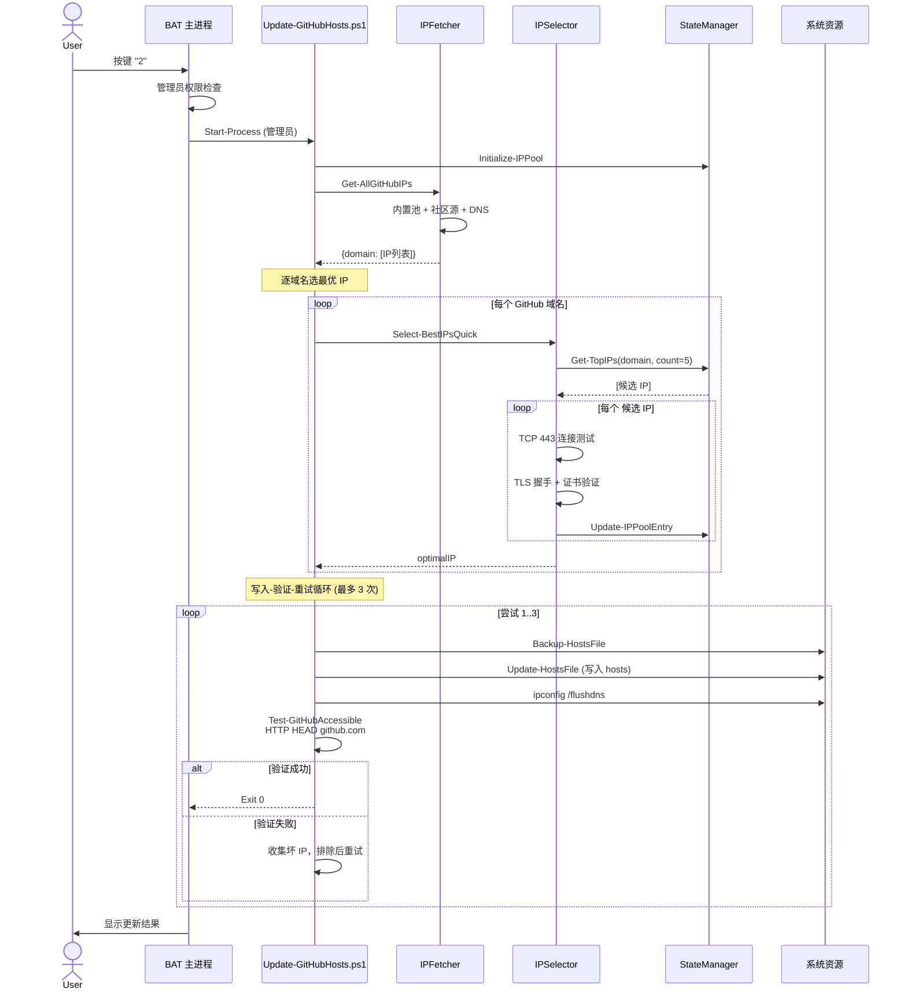

### 4.3 UC4.1 启动代理模式（正常流程）

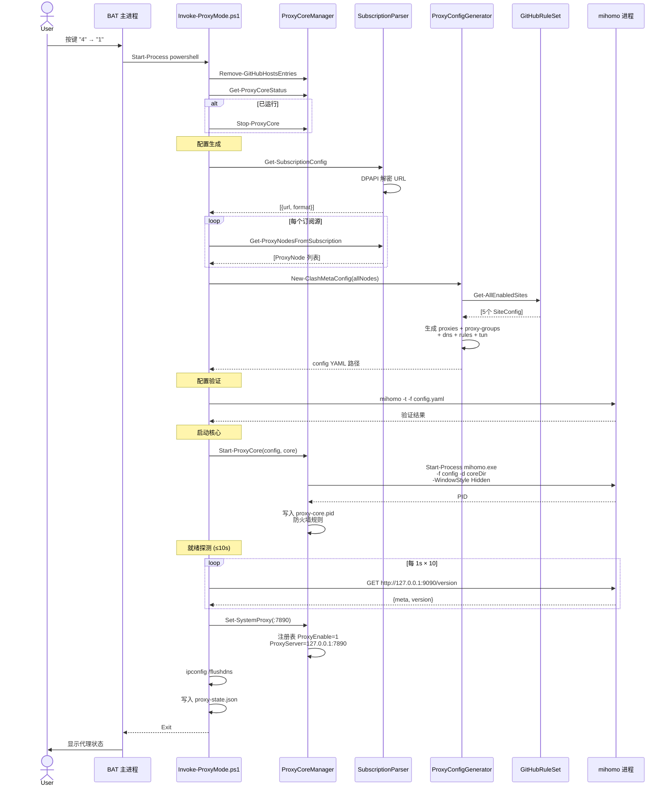

### 4.4 UC3 MonitorServer 启动与运行

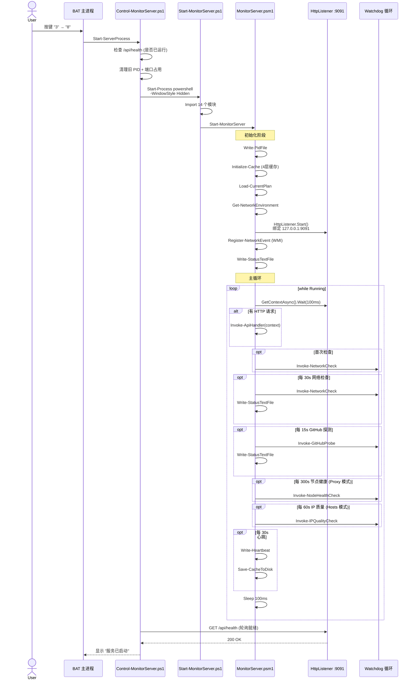

### 4.5 自动恢复（异常流程 — GitHub 不可达）

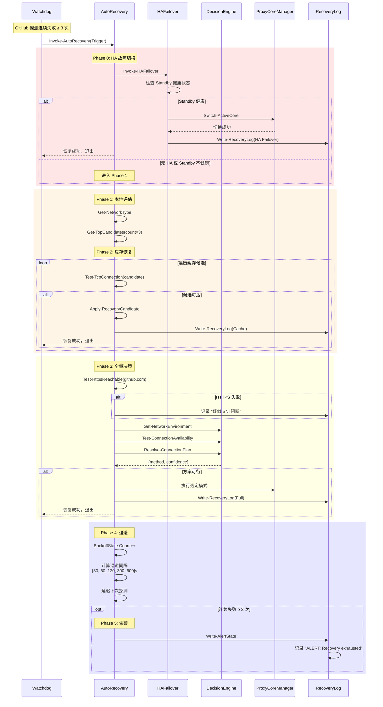

### 4.6 网络变更异常流程

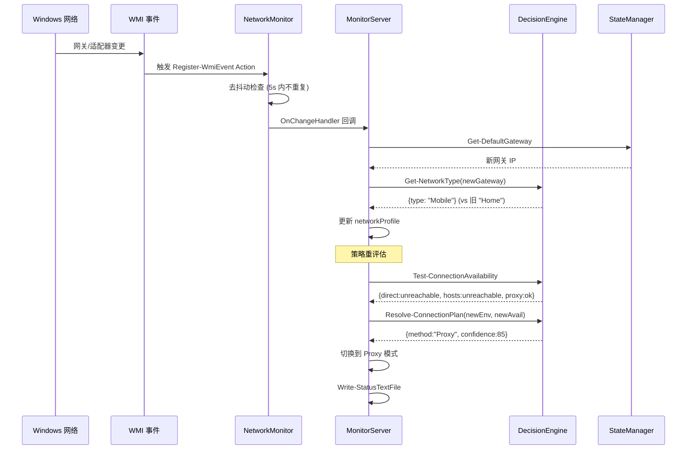

---

## 5. 主要状态机

### 5.1 IPPoolMaintainer 状态机 (F04-04)

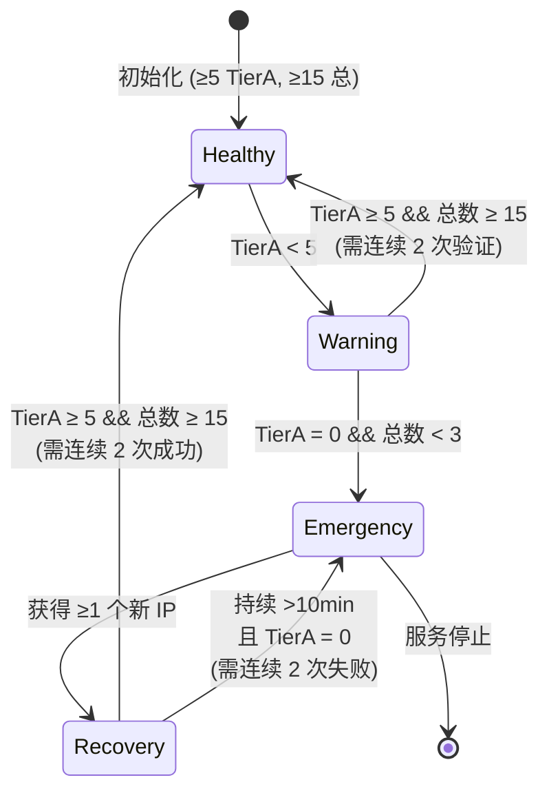

**检查间隔**:

| 状态 | 间隔 | 说明 |
|------|------|------|
| Healthy | 300s (5min) | 日常维护，轻量扫描 |
| Warning | 120s (2min) | 增强扫描，补充 IP |
| Emergency | 60s (1min) | 紧急获取，启用社区源+紧急池 |
| Recovery | 30s | 高频验证，确保恢复稳定 |

**状态持久化**: `%TEMP%\ip_pool_maintenance_state.json`
- TTL: 24 小时（过期从 Healthy 重新开始）
- 字段: CurrentState, StateEnterTime, FailureCount, SuccessCount, LastStateData

**代码定位**: `modules/IPPoolMaintainer.psm1:232-284` (状态转换逻辑)

### 5.2 NodePool 扫描阶段状态机 (F05-05)

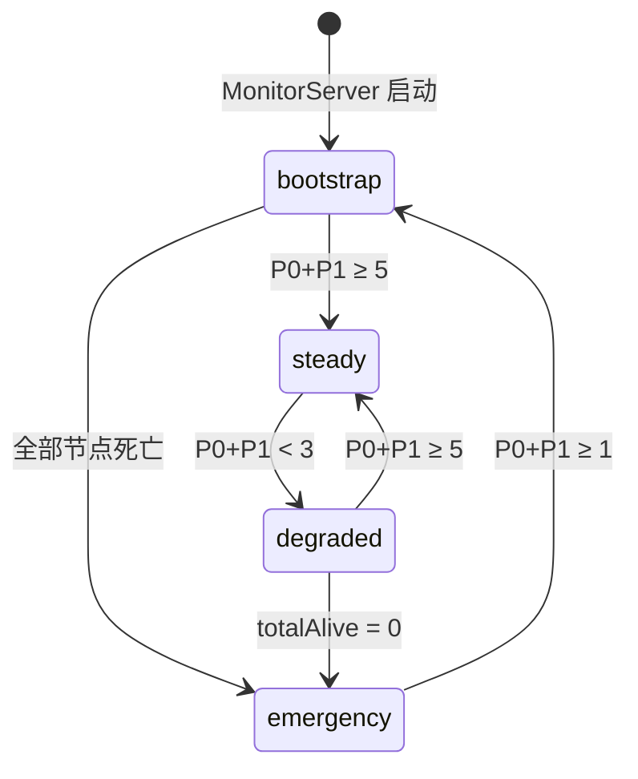

**扫描策略**:

| 阶段 | 全量扫描间隔 | 快检间隔 | 说明 |
|------|-------------|---------|------|
| bootstrap | 首次立即 | — | 启动时一次性扫描 |
| steady | 1800s (30min) | 600s (10min) | 定期全量 + 周期快检 |
| degraded | 600s (10min) | 300s (5min) | 加速扫描频率 |
| emergency | 60s | 30s | 最高频率，紧急发现节点 |

**代码定位**: `modules/NodePoolScanner.psm1:773-801` (阶段判断逻辑)

### 5.3 Proxy 模式状态机 (F05-01)

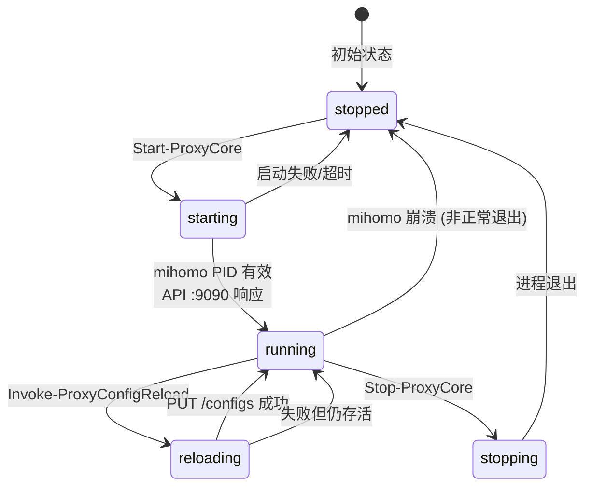

**状态判断逻辑** (`Get-ProxyCoreStatus`):

| 检查项 | 方法 | 说明 |
|--------|------|------|
| PID 存活 | `Get-Process -Id $pid -EA SilentlyContinue` | 进程级检查 |
| API 响应 | `GET http://127.0.0.1:9090/version` | 应用级检查 |
| 配置路径 | proxy-state.json.configPath | 配置文件有效性 |
| 一致性 | pid > 0 ↔ running = true | 交叉验证 |

**代码定位**: `modules/ProxyCoreManager.psm1:69-95` (停止), `:137-204` (启动)

### 5.4 自动恢复状态机 (F03-04)

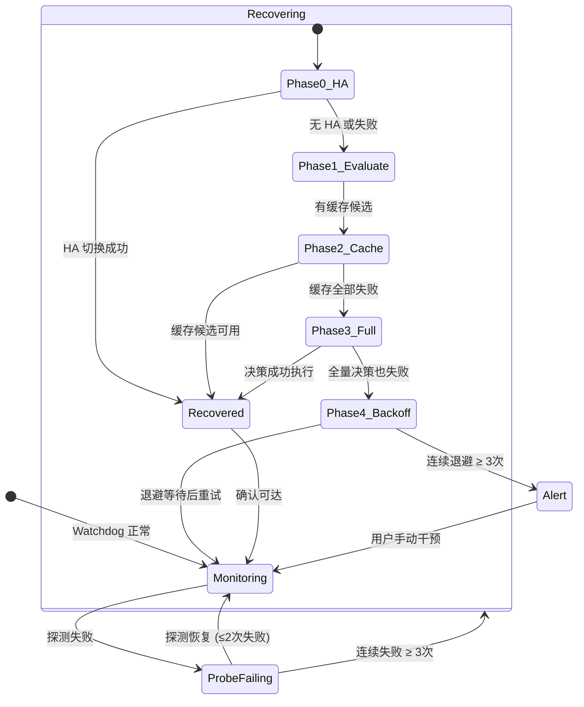

**退避间隔表**:

| 尝试次数 | 退避间隔 | 累计时间 |
|----------|---------|---------|
| 1 | 30s | 30s |
| 2 | 60s | 90s |
| 3 | 120s | 210s |
| 4 | 300s | 510s |
| 5+ | 600s | 600s/次 |

**代码定位**: `modules/MonitorServer.psm1:1968-2056` (Invoke-AutoRecovery)

---

## 6. 进程通信机制

### 6.1 通信矩阵

| 发起方 | 接收方 | 协议 | 端点 | 用途 |
|--------|--------|------|------|------|
| MonitorServer | mihomo | HTTP | `:9090/proxies` | 节点延迟测试 |
| MonitorServer | mihomo | HTTP | `:9090/configs` | 配置热重载 |
| MonitorServer | mihomo | HTTP | `:9090/providers` | 规则/代理提供者管理 |
| Control-MonitorServer | MonitorServer | HTTP | `:9091/api/health` | 健康检查 |
| BAT / scripts | MonitorServer | HTTP | `:9091/api/*` | 17+ REST API |
| MonitorServer | mihomo Standby | HTTP | `:9092/*` | HA 管理 |
| scripts | 系统注册表 | Win32 API | `HKCU:\...\Internet Settings` | 系统代理设置 |
| scripts | hosts 文件 | 文件 I/O | `%SystemRoot%\...\hosts` | IP 映射 |
| MonitorServer | 文件系统 | 文件 I/O | `data/*.json` | 状态持久化 |
| NetworkMonitor | WMI | 事件订阅 | `Win32_NetworkAdapter` | 网络变更检测 |

### 6.2 同步 vs 异步

| 操作 | 模式 | 超时 | 说明 |
|------|------|------|------|
| BAT → PS 脚本 | 同步 (Start-Process) | 无 (用户等待) | 脚本执行完 BAT 才继续 |
| MonitorServer → mihomo API | 同步 (Invoke-WebRequest) | 5-10s | 短超时，避免阻塞主循环 |
| MonitorServer HttpListener | 异步 (GetContextAsync) | 100ms | 非阻塞等待，配合主循环 |
| TCP 连接测试 | 异步 (BeginConnect) | 3-5s | APM 模式，并行探测 |
| WMI 网络事件 | 异步 (Register-WmiEvent) | 持续 | 事件驱动 + 5s 去抖 |
| Watchdog 定时检查 | 伪异步 (主循环计时) | 100ms 轮询 | 单线程内时间片轮转 |

---

## 7. 错误处理与容错机制

### 7.1 原子写入保障

```
写入流程:
1. $tempPath = "$targetPath.tmp"
2. ConvertTo-Json -Depth 10 | Out-File $tempPath
3. Move-Item $tempPath $targetPath -Force
```

**保证**: 即使写入过程中断电，目标文件要么是旧的完整版本，要么是新的完整版本，不会出现半写状态。

### 7.2 进程崩溃恢复

| 场景 | 检测机制 | 恢复策略 |
|------|---------|---------|
| mihomo 崩溃 | NodeHealthCheck (300s) 探测 API 失败 | AutoRecovery Phase 0-3 |
| MonitorServer 崩溃 | BAT 菜单检查 /api/health | 用户手动重启 (BAT 3.8) |
| PowerShell 脚本异常 | try/catch + $ErrorActionPreference | 日志记录 + 退出码 |
| hosts 文件损坏 | Test-GitHubAccessiblePostUpdate | 回滚 Backup-HostsFile |
| JSON 解析失败 | ConvertFrom-Json try/catch | Warning + 内嵌默认值 |

### 7.3 降级策略

```
完整功能链:
  TUN(全协议) → 系统代理(HTTP/S) → Hosts(仅 GitHub 域名) → Direct(直连)

降级触发条件:
  - 订阅源失效 → Proxy 模式不可用 → 降级到 Hosts
  - IP 池耗尽 → Hosts 模式不可用 → 降级到 Direct
  - 网络本身可达 → Direct 模式直接工作
  - 网络被墙 → Direct 失败 → 告警用户
```

---

## 8. 性能约束

| 约束 | 值 | 来源 |
|------|-----|------|
| 节点池上限 | 200 节点 | NodePoolScanner.maxPoolSize |
| 历史记录上限 | 100 条 | proxy-state.json history[] |
| 主循环最小间隔 | 100ms | MonitorServer Sleep |
| hosts 备份 | 1 份 (hosts.backup) | Update-GitHubHosts |
| 缓存文件数 | ≤ 10 (各类 cache/*.json) | CacheManager |
| TCP 探测超时 | 3-5s (可配) | IPScanner / DecisionEngine |
| mihomo 启动就绪超时 | 10s | Invoke-ProxyMode |
| MonitorServer 启动就绪超时 | 15s | Control-MonitorServer |
| 退避上限 | 600s | AutoRecovery |
