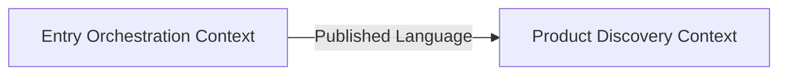
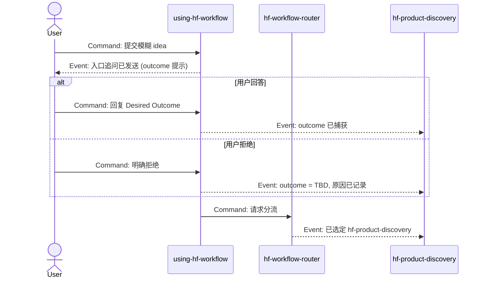

# Phase 0 Dry-run 演示：HF 模板跑通性验证

## 目的

本文是 Phase 0 落地后，对新引入的 discovery / specify / design 模板和 `hf-experiment` 节点做一次**冷读跑通**。目的不是"做一个真实项目"，而是用一个仓库真实存在的候选主题，验证：

1. `hf-product-discovery` 新模板（JTBD / OST / RICE / Desired Outcome）能承接一句模糊 idea，产出可评审草稿
2. `hf-specify` 新模板（Success Metrics / Key Hypotheses / NFR QAS）能从 discovery bridge 自然衔接
3. `hf-design` 新模板（DDD 战略 / Event Storming / QAS 承接 / STRIDE）能从 spec 自然衔接
4. `hf-experiment` 能在 Blocking 假设出现时作为 conditional insertion 插入

演示选用的模糊主题是：**"HF 在 discovery 阶段新增一个入口提问，把 Desired Outcome 主动引出来"**——这是 Phase 0 工作本身暴露出的候选 iteration，天然适合做 dry-run。

实际跑 feature 时，这些草稿会分别落到 `docs/insights/`、`features/<NNN>-<slug>/spec.md`、`features/<NNN>-<slug>/design.md`。本文只做模板跑通性演示，**并未创建 feature 目录**。

---

## A. Discovery 草稿（dry-run）

> 按 `skills/hf-product-discovery/references/discovery-template.md` 的默认结构。
> 实际产物应保存到 `docs/insights/2026-04-22-outcome-prompt-discovery.md`。

```markdown
# Outcome Prompt 产品发现草稿

- 状态: 草稿（dry-run 演示）
- 主题: HF 在 discovery 入口新增 Desired Outcome 主动提问

## 1. 问题陈述

新用户在第一次进入 HF 时，倾向于直接说"我想做 X 产品"，而不会主动交出 Desired Outcome。这让 `hf-product-discovery` 的 section 9 经常在评审环节才被发现空缺，discovery-review 首次通过率偏低。

## 2. 目标用户与使用情境

- 角色：第一次使用 HF 的 PM / tech lead / 个人开发者
- 情境：会话起步，用户输入一句话 idea；当前 HF 并不会在入口主动问"你这一轮想变好的结果指标是什么"

## 3. Why now

Phase 0 已经强制 discovery / spec 必须显式写 Desired Outcome + Success Threshold。如果入口不引导，用户会把这个字段写成"体验更好"这种无阈值口号，导致模板合规但内容无效。

## 4. 当前轮 wedge / 最小机会点

在 `using-hf-workflow` / `hf-product-discovery` 入口追问一次 outcome，且只针对"模糊 idea"分流触发。

## 5. 已确认事实

- Phase 0 模板已要求 discovery 草稿 section 9 必填 Outcome Metric + Threshold（证据：`skills/hf-product-discovery/references/discovery-template.md`）
- Review 层已把"outcome 缺失或空洞"列为典型 findings

## 6. 关键假设与风险

- HYP-A（Desirability）：用户愿意在入口回答 outcome 提问，而不是觉得被打扰
- HYP-B（Feasibility）：入口追问不会过度膨胀 `using-hf-workflow` 的职责边界
- HYP-C（Usability）：追问 1 次而非多轮，足以把 outcome 引出来

## 7. 候选方向与排除项

- 候选 A：入口显式追问（A1 文本提示 / A2 表单式模板）
- 候选 B：不追问，仅靠 discovery section 9 模板约束（现状）
- 排除 B：已观测到模板约束不足以驱动内容质量

## 8. 建议 probe / 验证优先级

- HYP-A / HYP-C 低 confidence → 走 `hf-experiment`：5 次真实对话抽检，阈值 ≥ 3 次在追问后给出可判定 outcome

## 9. 成功度量 (Desired Outcome / North Star / Success Metrics)

- Desired Outcome: 新 discovery 会话在首次通过评审时携带可判定 Desired Outcome 的比例
- North Star 锚定: "HF 可评审工件产出率"；项目 North Star 尚未形式化声明
- Leading 指标: 入口追问触发后 Desired Outcome 字段完成率
- Lagging 指标: discovery-review 首次通过率
- Success Threshold: 5 轮样本中 ≥ 3 次首次通过
- Non-goal Metrics: 不追求缩短整体 coding workflow 总耗时；不追求一次问完所有 discovery 章节
- Instrumentation Debt: 无；评审记录目录已具备统计能力

## 10. JTBD 视图

```
When 我刚进入 HF 想"做一个新东西"，
I want to 很快被提示一下这一轮我想让什么变好，
so I can 不在 discovery 写到一半才发现自己没锁定成功指标。
```

## 11. OST Snapshot

Desired Outcome: discovery-review 首次通过率 ≥ 70%

Opportunity A：新用户进入 HF 时不会主动交出 outcome
  Solution A1：入口文本追问
    Assumption: HYP-A（用户愿意回答） → Probe：5 次对话抽检
  Solution A2：入口表单式模板
    Assumption: HYP-C（一次追问足够） → Probe：与 A1 对照观察

Opportunity B：outcome 写出来但无阈值
  → 由 Phase 0 模板已覆盖，本轮不做

## 12. Bridge to Spec

- 进入 spec：Opportunity A + Solution A1 作为当前轮范围；Desired Outcome 与 Threshold 已稳定
- 继续作为 assumption：HYP-A / HYP-C 尚未验证，建议先走 `hf-experiment`
- 不进入 spec：Opportunity B（模板已覆盖）、Solution A2（本轮作为对照，不正式实现）

## 13. 开放问题

- 阻塞：HYP-A 是否成立 → 进入 `hf-experiment`
- 非阻塞：追问的文案是否需要多语言
```

**承接检验**：

- [x] Desired Outcome / Threshold / Non-goal / Instrumentation Debt 全部填齐
- [x] JTBD 情境驱动，outcome 可观察
- [x] OST 有 Outcome / Opportunity / Solution / Assumption 四层
- [x] Bridge to Spec 锁定进入 spec 的范围与仍需验证的假设
- [x] 标注了应走 `hf-experiment` 的假设（HYP-A / HYP-C）

---

## B. Probe Plan（dry-run，`hf-experiment` 激活）

> 按 `skills/hf-experiment/references/probe-plan-template.md`。
> 实际产物：`docs/experiments/2026-04-22-outcome-prompt/probe-plan.md`。

```markdown
# Outcome Prompt Probe Plan

- 状态: 计划
- 上游锚点:
  - Discovery: docs/insights/2026-04-22-outcome-prompt-discovery.md

## 1. 本轮 probe 覆盖的假设

| ID | Restatement | Type | Blocking? | Confidence (probe 前) |
|----|-------------|------|-----------|-----------------------|
| HYP-A | 用户愿意在 HF 入口回答一次 Desired Outcome 提问 | Desirability | 是 | 低 |
| HYP-C | 一次追问足以让用户给出可判定 outcome | Usability | 否 | 中 |

不覆盖：HYP-B（入口职责边界，先走设计审查）

## 2. 验证方式
- Method: 用户访谈（5 位）+ 话术走查
- 理由: Desirability + Usability，最小代价先找 5 条真实信号

## 3. 样本 / 参与者 / 数据范围
- 数量: 5
- 来源: HF 现有早期用户名单
- 筛选: 至少一次使用过 HF 的 `using-hf-workflow` 入口

## 4. Setup
- 需要准备: 访谈大纲 + 模拟追问话术
- 是否涉及产品代码: 否

## 5. Success Threshold（事先写死）
- ≥ 3/5 在追问后能给出可判定的 Desired Outcome
- ≥ 3/5 主观评价追问"帮到自己"

## 6. Failure Threshold（事先写死）
- ≤ 1/5 给出可判定 outcome
- ≥ 3/5 觉得追问打扰

## 7. Timebox
- 5 天；超时 = Inconclusive

## 8. Evidence 归档
- 路径: docs/experiments/2026-04-22-outcome-prompt/artifacts/
- 包含: 访谈笔记 / 话术版本 / 评分表

## 9. Rollback / Cleanup
- 无产品侧改动，无需回滚

## 10. 下游回流目标（事先声明）
- Pass: 回 `hf-specify` 起草 spec（HYP-A 清除 Blocking）
- Fail: 回 `hf-product-discovery` 修订 OST（Opportunity A 可能需要替换方向）
- Inconclusive: 回 `hf-workflow-router`
```

**承接检验**：

- [x] Success / Failure Threshold 事先写死
- [x] 覆盖假设 ≤ 2 且共享同一验证路径
- [x] Setup 未引入生产代码
- [x] 回流目标事先对三档结果都做了声明

---

## C. Spec 草稿（dry-run，假设 HYP-A / HYP-C 已走 probe 并 Pass）

> 按 `skills/hf-specify/references/spec-template.md`。
> 实际产物：`features/NNN-outcome-prompt/spec.md`。

```markdown
# Outcome Prompt 需求规格说明

- 状态: 草稿（dry-run）
- 主题: HF 入口 Desired Outcome 追问

## 1. 背景与问题陈述
承接 discovery section 1。新用户在入口不会主动交出 outcome。

## 2. 目标与成功标准
让首次 discovery 草稿自然携带可判定 Desired Outcome，整体驱动 discovery-review 首次通过率提升。

## 3. Success Metrics
- Outcome Metric: discovery-review 首次通过率
- Threshold: 5 轮样本中 ≥ 3 次首次通过
- Leading: 入口追问触发后 outcome 字段完成率 ≥ 90%
- Lagging: 30 天滚动 discovery-review 首次通过率 ≥ 70%
- Measurement Method: 基于 `docs/reviews/` 每周快照
- Non-goal Metrics: 不追求缩短 coding workflow 总耗时
- Instrumentation Debt: 无

## 4. Key Hypotheses

| ID | Statement | Type | Impact If False | Confidence | Validation Plan | Blocking? |
|---|---|---|---|---|---|---|
| HYP-A | 用户愿意回答一次 outcome 追问 | Desirability | 本 spec 基本作废 | 高（probe Pass 后更新） | 已完成 probe | 否 |
| HYP-C | 一次追问足以引出可判定 outcome | Usability | 需改为 2 轮追问 | 中 | 将在 MVP 上线后 1 周复测 | 否 |
| HYP-B | 入口追问不越职责边界 | Feasibility | 需要抽独立节点 | 中 | 由 design review 评估 | 否 |

## 5. 用户角色与关键场景
- 新用户首次进入 HF 会话
- 已有用户开启新主题的首次 discovery

## 6. 当前轮范围与关键边界
- 只在入口文本追问一次
- 只触发在"模糊 idea"分流下（现有 Boundary With Product Discovery 规则）

## 7. 范围外内容
- 不在入口追问 Non-goal Metrics（留在 discovery 草稿内）
- 不实现表单式 UI（Solution A2 延后）

## 8. 功能需求

### FR-001 入口 Desired Outcome 追问

- 优先级: Must
- 来源: 用户请求"让入口帮我锁定 outcome"；HYP-A
- 需求陈述: 当用户在 `using-hf-workflow` 入口提交一条 ≤ 1 句话的模糊 idea 时，系统必须在进入任何具体 leaf skill 之前，向用户追问一次 Desired Outcome。
- 验收标准:
  - Given 用户输入模糊 idea；When 入口判定为 discovery 分流；Then 系统在选定 leaf skill 之前，产生一条追问消息，内容含"你这一轮想让什么指标变好 / 成功阈值是多少"；
  - Given 用户明确拒绝回答；When 入口收到拒绝信号；Then 系统不再追问并显式在 discovery 草稿 section 9 写入"用户拒绝 outcome 追问，outcome 置为 TBD"。

## 9. 非功能需求 (ISO 25010 + QAS)

### NFR-001 追问响应时延

- 类别: Performance Efficiency / Time behavior
- 优先级: Should
- 来源: UX 经验
- QAS:
  - Stimulus Source: 入口用户
  - Stimulus: 提交模糊 idea
  - Environment: 正常负载
  - Response: 生成追问消息
  - Response Measure: 从提交到追问显示 ≤ 500ms
- Acceptance: Given 正常负载；When 用户提交模糊 idea；Then 追问消息在 500ms 内显示。

### NFR-002 可观测性与追溯

- 类别: Maintainability / Analyzability
- 优先级: Must
- QAS:
  - Stimulus Source: discovery 评审回溯
  - Stimulus: 审计某条 discovery 草稿的入口追问是否发生
  - Environment: 正常运行
  - Response: 追问事件可在 review 归档中回读
  - Response Measure: 100% 触发追问的会话在 discovery 草稿 section 9 含 "入口追问: yes/no/用户拒绝"

## 13. 开放问题
- 非阻塞：追问文案 i18n 策略

## 14. 术语
- Desired Outcome: 本轮想变好的结果指标；discovery 与 spec 一致使用 "Desired Outcome"，不写 "目标"
- 模糊 idea: 用户首次输入，≤ 1 句话且未携带 outcome 的产品想法
```

**承接检验**：

- [x] Success Metrics 全字段填齐，且承接了 discovery section 9
- [x] Key Hypotheses 标注清 Blocking 情况；HYP-A Confidence 因 probe 提升
- [x] 至少 1 条核心 NFR 有完整 QAS 五要素
- [x] FR-001 的 Source 显式指向 HYP-A
- [x] 术语与 discovery Ubiquitous Language 一致

---

## D. Design 草稿（dry-run 摘要，承接 QAS + 加 DDD / Event Storming / STRIDE）

> 按 `skills/hf-design/references/design-doc-template.md`（完整起来太长，这里只演示新增章节的最小落地）。
> 实际产物：`features/NNN-outcome-prompt/design.md`。

### 4. Domain Strategic Model（Phase 0）

- **Bounded Context**
  - `Product Discovery Context`：JTBD / OST / 模糊 idea / Desired Outcome 收敛
  - `Entry Orchestration Context`：`using-hf-workflow` 的入口分流与追问
- **Ubiquitous Language（新增）**
  - 模糊 idea：在 `Entry Orchestration Context` 内，特指"用户输入 ≤ 1 句话且未携带 outcome 的产品想法"；与 `Product Discovery Context` 内的"初稿想法"不同义
- **Context Map**



### 5. Event Storming Snapshot（standard 档）



Hotspot（红色）：用户"明确拒绝"这一路径是 UX 与合规的交叉点，已转为 ADR 候选 `ADR-00XX 拒绝追问的行为策略`。

### 14. NFR QAS 承接（摘要）

| NFR ID | ISO 25010 维度 | QAS 摘要 | 设计承接模块 | 可观测手段 | 验证方法 | 失败模式 & 缓解 | ADR |
|---|---|---|---|---|---|---|---|
| NFR-001 | Performance | 入口用户 / 提交模糊 idea / 正常负载 / 追问显示 / ≤500ms | Entry Orchestration 的追问生成器 | `entry_prompt_latency_ms` | 集成测试 + p95 SLI | 模型调用慢 → 本地静态追问兜底 | ADR-00XY |
| NFR-002 | Maintainability | review 回溯 / 审计追问 / 正常运行 / 可回读 / 100% | discovery 草稿 section 9 写入契约 | 评审日志按 feature 聚合 | review 检查脚本 | 写入失败 → 强制人工补齐 | — |

### 15. Threat Model (STRIDE)

触发判断：不涉及认证 / 授权 / 个人敏感数据，**不跨信任边界**（入口追问只在用户自己会话内）。显式跳过：

> 本轮无关键信任边界，跳过 STRIDE；如未来追问文案走服务端渲染并引入第三方调用，再重新激活。

---

## 跑通性结论

- **hf-product-discovery 新模板**：JTBD / OST / RICE（本例未引入 RICE，因候选只有 A1 一个强方向）/ Desired Outcome 全部可按模板书写，且 Bridge to Spec 清晰指向 `hf-experiment`。
- **hf-experiment 新 skill**：从 discovery 插入顺滑；probe-plan 模板字段齐全，三档回流目标显式；Pass 后回流到 `hf-specify` 的承接清晰。
- **hf-specify 新模板**：Success Metrics 从 discovery section 9 无痛搬进；Key Hypotheses 承接 discovery OST 的 Assumption；QAS 对"性能" 和"可观测性"两条 NFR 均适用。
- **hf-design 新模板**：DDD 战略建模在本例中规模正确（2 个 Context）、Event Storming 足以捕获用户同意 / 拒绝两路径；NFR QAS 承接表与 spec QAS 一致；STRIDE 按 opt-out 规则显式跳过并写明理由。
- **profile 密度分级**：本例是 standard 深度；若降为 lightweight，仅保留 Outcome + Threshold + 1 条核心 NFR QAS + Key Hypotheses 最小表达即可。

结论：Phase 0 新增模板在一个真实候选主题上**可冷读、可承接、可回流**，跑通性验证通过。

## 还需要在真实 feature 上验证的事项

Dry-run 无法替代真实 feature 运行。以下事项建议在下一个真实 feature 上继续验证：

- 入口追问的真实用户反应（对应 HYP-A / HYP-C）——这是本 dry-run 中演示的 `hf-experiment` 会回答的问题
- `hf-ui-design` 并行路径在本 feature 中没有触发（纯入口文本追问），未覆盖 UI 并行场景
- standard / lightweight profile 下模板密度表现，本例只跑了 standard 档
- 真实 reviewer subagent 对新 verification 列表的消化情况
