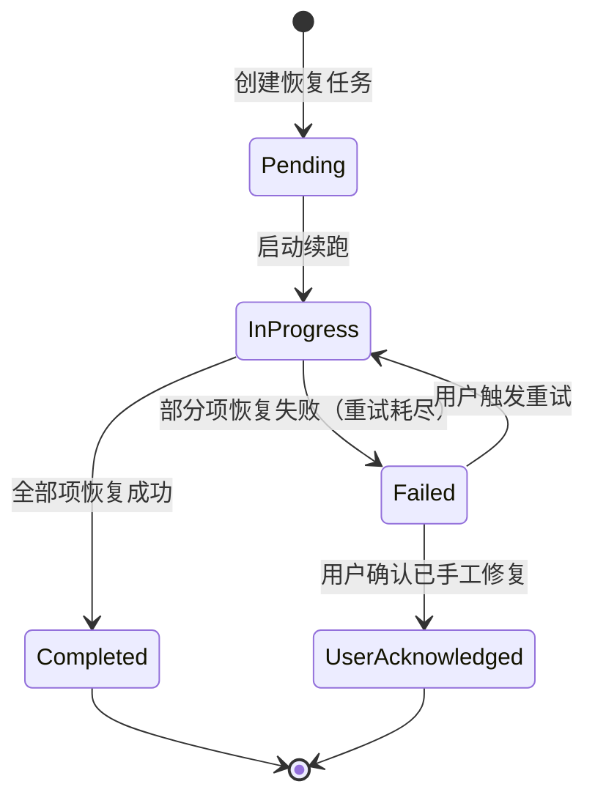

# Feature 001: 安装后网络评估与基线恢复 — 设计

- **Feature**: 001-baseline-restore
- **阶段**: `hf-design`
- **状态**: 草稿
- **日期**: 2026-05-12
- **上游输入**: `features/001-baseline-restore/spec.md`
- **关联 ADR**: ADR-0003, ADR-0004, ADR-0005

## 1. 设计概述

Feature 001 是 GoGuo 的安全前置层。它提供 baseline 快照采集/确认/对比/恢复的完整生命周期管理，以及 Proxy Guard 异常监控和审计日志能力。其他 Feature（002/003/004）的消费关系：

- Feature 002 扩展 PlatformAdapter 实现 WSL 和独立 Linux 侧状态项
- Feature 003 的规则变更安全依赖 baseline 恢复机制
- Feature 004 的 UI 通过 Tauri Commands 消费本 feature 的全部交互语义

## 2. 模块设计

### 2.1 BaselineManager

**职责**：管理 baseline 快照的完整生命周期——采集、形成、确认、对比、恢复。

```rust
struct BaselineManager {
    platform_adapters: Vec<Box<dyn PlatformAdapter>>,
    storage: BaselineStorage,
    audit_logger: Arc<AuditLogger>,
}
```

**核心接口**：

| 方法 | 说明 | 对应需求 |
|------|------|----------|
| `collect_initial_snapshot()` | 首次采集所有平台状态项 | FR-2.1.1 |
| `get_state_summary()` | 获取当前状态摘要（分类展示） | FR-2.2.2-R1 |
| `form_baseline()` | 基于当前状态形成 baseline 候选 | FR-2.2.1 |
| `confirm_baseline()` | 用户确认后保存 baseline 快照 | FR-2.2.1-R4 |
| `compare_with_baseline()` | 逐项对比当前值与 baseline | FR-2.3.2 |
| `restore_to_baseline()` | 停止/异常时恢复可恢复项 | FR-2.4.2 |
| `get_recovery_task()` | 读取未完成的恢复任务记录 | FR-2.6.1 |
| `resume_recovery()` | 续跑未完成的恢复任务 | FR-2.6.2 |

**Baseline 快照数据模型**：

```rust
struct BaselineSnapshot {
    version: u32,
    timestamp: DateTime<Utc>,
    environment: EnvironmentInfo,
    items: Vec<StateItem>,
}

struct StateItem {
    id: String,                    // 如 "windows-system-proxy"
    platform: Platform,            // Windows / Wsl / Linux
    category: StateItemCategory,   // Restorable / Detectable / Excluded
    value: serde_json::Value,
    collected_at: DateTime<Utc>,
    classification_reason: String,
}
```

**Baseline 存储**：
- 初始快照：`data/baseline/initial-snapshot.json`
- 确认的 baseline：`data/baseline/baseline-v1.json`（版本号递增）
- 只读，不可被 GoGuo 自动修改（FR-2.1.1-R2）

### 2.2 PlatformAdapter

**职责**：跨平台状态项读写的抽象接口。详见 ADR-0005。

**Windows 适配器状态项映射**：

| 状态项 ID | 采集方式 | 写入方式 | 分类 |
|-----------|----------|----------|------|
| `win-hosts` | 读 `%SystemRoot%\...\hosts` | 写回文件 | 可恢复项 |
| `win-system-proxy` | 读注册表 `ProxyEnable/ProxyServer/ProxyOverride` | 写注册表 | 可恢复项 |
| `win-pac` | 读注册表 `AutoConfigURL` | 写注册表 | 可恢复项 |
| `win-http-proxy` | `netsh winhttp show proxy` | — | 可检测不可恢复项 |
| `win-dns-cache` | `ipconfig /displaydns` | — | 可检测不可恢复项 |
| `win-dns-servers` | 网络适配器 DNS 配置 | — | 可检测不可恢复项 |
| `win-proxy-processes` | 进程扫描 + 端口检测 | — | 可检测不可恢复项 |
| `win-tun-status` | TUN 适配器状态 | — | 可检测不可恢复项 |
| `win-wsl2-network-mode` | 读 `.wslconfig` | — | 可检测不可恢复项 |

**WSL 适配器状态项映射**（Feature 002 扩展）：

<!-- [?] id:01;status:close;date:2026-05-14T14:40  WSL/Linux是作为一个适配器，还是分开成两个？WSL和独立linux操作系统下的这些状态项的检测/恢复都完全一样吗？如果有差异，建议还是分成两个adapt，这样支持在独立的linux环境下部署goguo；任务处理结果：拆分为 WslAdapter 和 LinuxAdapter 两个独立适配器，共享 LinuxBaseAdapter 公共逻辑。WslAdapter 额外包含 WSL2 网络模式检测；LinuxAdapter 面向独立 Linux 环境。DeploymentMode 从 WslLinuxOnly 拆为 WslOnly / LinuxOnly。同步更新 ADR-0005、Feature 002/004 设计。-->

<!-- [?] id:02;status:close;date:2026-05-14T14:47  WSL/Linux适配器下，是否缺少WSL2 网络模式（NAT / 镜像）的检测项？如果仅在wsl下部署，这个状态项还是需要检测的；任务处理结果：已将 `wsl-wsl2-network-mode` 加入 WslAdapter 状态项表。该检测项从 WSL 内部读取 `/proc/version` 或 `.wslconfig` 判断网络模式，直接影响 Feature 002 的配置策略选择。-->

| 状态项 ID | 采集方式 | 写入方式 | 分类 |
|-----------|----------|----------|------|
| `wsl-proxy-env` | 读环境变量 | `export` 当前会话 | 可恢复项 |
| `wsl-git-proxy` | `git config --global` | `git config --global` | 可恢复项 |
| `wsl-resolv-conf` | 读 `/etc/resolv.conf` | 写文件（需 root） | 可恢复项 |
| `wsl-etc-environment` | 读 `/etc/environment` | 写文件（需 root） | 可恢复项 |
| `wsl-shell-proxy` | 扫描 `.bashrc/.zshrc` | — | 可检测不可恢复项 |
| `wsl-reachability` | `curl` 测试 | — | 可检测不可恢复项 |
| `wsl-wsl2-network-mode` | 读 `/proc/version` + `.wslconfig` | — | 可检测不可恢复项 |

**Linux 适配器状态项映射**（Feature 002 扩展）：

独立 Linux 环境下，无 WSL2 网络模式相关检测项，其余状态项与 WSL 适配器一致。两个适配器共享 `LinuxBaseAdapter` 公共读写逻辑（环境变量、Git 配置、`/etc/resolv.conf`、`/etc/environment`）。

| 状态项 ID | 采集方式 | 写入方式 | 分类 |
|-----------|----------|----------|------|
| `linux-proxy-env` | 读环境变量 | `export` 当前会话 | 可恢复项 |
| `linux-git-proxy` | `git config --global` | `git config --global` | 可恢复项 |
| `linux-resolv-conf` | 读 `/etc/resolv.conf` | 写文件（需 root） | 可恢复项 |
| `linux-etc-environment` | 读 `/etc/environment` | 写文件（需 root） | 可恢复项 |
| `linux-shell-proxy` | 扫描 `.bashrc/.zshrc` | — | 可检测不可恢复项 |
| `linux-reachability` | `curl` 测试 | — | 可检测不可恢复项 |

### 2.3 ProxyGuard

**职责**：持续监控 mihomo 进程、端口和系统代理一致性。

```rust
struct ProxyGuard {
    mihomo_manager: Arc<MihomoManager>,
    platform_adapter: Arc<dyn PlatformAdapter>,
    audit_logger: Arc<AuditLogger>,
    config: ProxyGuardConfig,
}

struct ProxyGuardConfig {
    check_interval: Duration,     // 默认 3s
    max_restart_attempts: u32,    // 默认 3
    restart_cooldown: Duration,   // 默认 10s
}
```

**监控对象与行为**：

| 监控对象 | 检查方式 | 异常行为 |
|----------|----------|----------|
| mihomo 进程 | 进程存活检测 | 自动重启（≤3 次），超限恢复 baseline |
| mihomo 端口 | TCP connect | 标记不可达，触发重启 |
| mihomo API | `GET /version` | 标记异常，触发重启 |
| 子进程残留 | 进程扫描匹配 | 清理 + 审计记录 |
| 系统代理设置 | 读注册表 + 对比当前模式 | 不一致时恢复到 baseline |

### 2.4 MihomoManager

**职责**：管理 mihomo 子进程的完整生命周期。详见 ADR-0003。

```rust
struct MihomoManager {
    process: Option<Child>,
    config_path: PathBuf,
    api_address: SocketAddr,
    api_secret: String,
}
```

**核心接口**：

| 方法 | 说明 |
|------|------|
| `start()` | 启动 mihomo 子进程，等待 API 就绪 |
| `stop()` | 优雅停止（SIGTERM → 超时 SIGKILL） |
| `reload_config(yaml_path)` | 写入配置 + PUT /configs 热重载 |
| `health_check()` | GET /version + 端口检测 |
| `is_running()` | 进程存活 + API 可达 |

### 2.5 AuditLogger

**职责**：结构化审计日志，只追加，JSONL 格式。

```rust
struct AuditRecord {
    timestamp: DateTime<Utc>,
    action: AuditAction,        // BaselineConfirm / StateRestore / ProxyGuard / RuleApply / ...
    target: String,             // 操作对象（状态项 ID / 站点 ID）
    result: AuditResult,        // Success / Failure / Skipped
    reason: Option<String>,     // 原因（成功时可选，失败时必填）
    details: serde_json::Value, // 操作详情（修改前值、修改后值等）
}
```

**五要素失败提示生成**：

```rust
struct FailureExplanation {
    cause: String,              // 原因
    attempted_actions: Vec<String>, // 已尝试动作
    attempt_count: (u32, u32),  // (当前次数, 最大次数)
    suggested_action: String,   // 建议动作（用户可执行）
    needs_manual_intervention: bool, // 是否需要手动处理
}
```

### 2.6 ConfigManager

**职责**：管理用户配置和部署组合。

```rust
struct AppConfig {
    deployment_mode: DeploymentMode,  // WindowsOnly / WslOnly / LinuxOnly / Coordinated
    install_root: PathBuf,
    mihomo: MihomoConfig,
    proxy_guard: ProxyGuardConfig,
    probe: ProbeConfig,               // Feature 003 探测配置
    non_target_probe_sites: Vec<String>,  // Feature 003 A/B 验证参考站点
    notifications: NotificationConfig,
}
```

<!-- [?] id:03;status:close;date:2026-05-14T15:00  'MihomoConfig'结构未定义；任务处理结果：已在下方补充 MihomoConfig 结构定义，包含二进制路径、配置目录、API 地址、密钥、混合代理端口和日志级别。-->

```rust
struct MihomoConfig {
    binary_path: PathBuf,           // mihomo 可执行文件路径（随 GoGuo 分发）
    config_dir: PathBuf,            // data/mihomo/
    api_address: SocketAddr,        // 默认 127.0.0.1:9090
    api_secret: String,             // API 鉴权密钥（自动生成）
    mixed_port: u16,                // 混合代理端口（默认 7890）
    log_level: String,              // mihomo 日志级别（默认 warning）
}
```

## 3. 数据模型

### 3.1 恢复任务记录

```rust
struct RecoveryTask {
    id: Uuid,
    created_at: DateTime<Utc>,
    status: RecoveryStatus,     // Pending / InProgress / Completed / Failed / UserAcknowledged
    pending_items: Vec<RecoveryItem>,
    completed_items: Vec<RecoveryItem>,
}

struct RecoveryItem {
    state_item_id: String,
    target_value: serde_json::Value,  // baseline 值
    result: Option<ItemResult>,
    failure_reason: Option<String>,
}
```

存储路径：`data/state/recovery-task.json`

## 4. Tauri Commands（UI 交互接口）

| Command | 说明 | 对应需求 |
|---------|------|----------|
| `start_initial_assessment` | 开始首次网络评估 | FR-2.1.1 |
| `get_state_summary` | 获取当前状态摘要 | FR-2.2.2 |
| `trigger_readjustment` | 触发重新采集 | FR-2.2.1-R2 |
| `confirm_baseline` | 确认 baseline（需二次确认） | FR-2.2.2-R3 |
| `get_baseline_status` | 获取 baseline 偏离状态 | FR-2.3.2 |
| `stop_service` | 停止服务并恢复（需二次确认） | FR-2.4.1 |
| `get_service_status` | 获取服务运行状态 | FR-2.5 |
| `get_recovery_progress` | 获取恢复进度 | FR-2.4.2 |
| `get_audit_log` | 查询审计记录（含分页） | FR-2.7 |
<!-- [?] id:04;status:close;date:2026-05-14T15:06  'stop_service'在ProxyGuard检测mihomo 端口或mihomo API异常触发重启，而重启超限导致超限恢复 baseline时，需二次确认吗?;任务处理结果：明确区分两类触发源——①用户主动停止（`stop_service`）：必须二次确认；②ProxyGuard 自动恢复（mihomo 崩溃重启超限）：不需要二次确认，但必须通过 Tauri Event 通知用户（FR-2.5.2-R5、FR-2.5.3-R2）。理由：ProxyGuard 是自主守护机制，延迟等待用户确认会延长"系统代理指向死服务"的风险窗口。在 ProxyGuard 恢复流程中已改为 `restore_to_baseline_auto()`（自动模式，无确认，立即执行+通知）。-->
<!-- [TODO] id:05;status:close;date:2026-05-14T15:07  '查询审计记录'需要有分页机制；任务处理结果：已将 `get_audit_log` 命令扩展为支持分页和过滤。参数：`offset`、`limit`（默认 50，最大 200）、可选 `filter`（日期范围 `from/to`、操作类型 `action_type`）。返回：`total_count` + `records` 数组。审计日志文件按日期滚动（`audit-YYYY-MM-DD.jsonl`），查询时跨文件合并+过滤。-->
## 5. 关键流程

### 5.1 恢复流程（停止/异常）

1. 触发：用户停止 / Proxy Guard 检测到异常
2. 优先恢复：系统代理设置（风险最低）
3. 逐项恢复：按 PlatformAdapter 分组，每组内按风险从低到高
4. 即时验证：每项恢复后立即读回并对比 baseline
5. 结果处理：
   - 全部成功 → 验证非目标站点可达性 → 向用户展示结果
   - 部分失败 → 持久化恢复任务记录 → 展示五要素提示
6. 审计：所有操作记入审计日志

### 5.2 续跑流程

1. 启动时检查 `data/state/recovery-task.json`，若文件存在且任务状态为 `Pending` 或 `InProgress`，执行续跑
2. 若存在未完成任务，优先执行续跑
3. 续跑期间禁止新的网络修改操作
4. 续跑完成后验证并向用户展示结果

<!-- [TODO] id:06;status:close;date:2026-05-14T15:09  '续跑期间禁止新的网络修改操作'需要在UI上有提醒/蒙层限制用户操作机制；任务处理结果：Feature 004 设计中新增"恢复蒙层"组件（RecoveryOverlay）。续跑/恢复期间：UI 全屏半透明蒙层 + 居中进度卡片（当前恢复项/总数/预计剩余）；蒙层屏蔽所有侧边栏导航和操作按钮；仅保留"查看审计日志"只读入口。完成后自动关闭蒙层展示结果。此变更已同步到 Feature 004 design.md 和 ui-design.md。-->

<!-- [TODO] id:07;status:close;date:2026-05-14T15:11  启动时检查'recovery-task.json'需要明确检查最近的一个pendding（是否仅pendding？）的任务（因为所有的恢复任务都记录在这个json文件中），同时给出状态机设计，需要考虑异常处理逻辑如续跑失败+用户手工操作后如何闭环？；任务处理结果：已设计恢复任务状态机（见下方 §5.3）。存储格式为单任务（至多一个 RecoveryTask），不保留历史记录。续跑失败后用户手工处理的闭环路径：Failed → 用户手工修复 → 点击"确认已修复"→ UserAcknowledged（系统可选择性重新采集 baseline 对比验证）。-->

### 5.3 恢复任务状态机



**状态说明**：

| 状态 | 含义 | 可触发动作 |
|------|------|-----------|
| `Pending` | 任务已创建，尚未开始执行 | 自动续跑 |
| `InProgress` | 正在执行恢复 | — |
| `Completed` | 所有可恢复项成功恢复 | 终态 |
| `Failed` | 部分项恢复失败（已重试耗尽） | 用户可触发重试（回到 InProgress）或确认手工修复 |
| `UserAcknowledged` | 用户确认已手工修复失败项 | 终态 |

**闭环场景**：

1. **续跑成功**：Pending → InProgress → Completed（正常闭环）
2. **续跑失败**：Pending → InProgress → Failed → 展示五要素提示
3. **用户手工修复后闭环**：Failed → 用户手工修复失败项 → UI 点击"确认已修复" → UserAcknowledged
4. **用户重试**：Failed → 用户点击"重新恢复" → InProgress → Completed/Failed

**存储格式**（单任务，无历史）：

`data/state/recovery-task.json` 存储至多一个 `RecoveryTask`，文件不存在或任务终态（Completed / UserAcknowledged）时表示无待处理恢复任务。

启动时查询逻辑：读取文件，若存在且 `status == Pending || status == InProgress`，执行续跑。
## 6. 约束与不变量

- **C1**: 初始快照在 GoGuo 修改任何网络配置之前采集（FR-2.1.1-R1）
- **C2**: Baseline 快照一旦确认，只读不可被自动修改（FR-2.1.1-R2）
- **C3**: 仅可恢复项参与自动恢复，可检测不可恢复项仅输出提示（FR-2.3.3-R1）
- **C4**: 恢复验证失败时不得静默跳过（FR-2.3.3-R4）
- **C5**: 审计不得包含用户访问内容明细（FR-2.7.1-R6~R8）

## 7. 风险与缓解

| 风险 | 缓解 |
|------|------|
| Windows 注册表写入被拒绝 | 检测权限 + 管理员运行建议 + 五要素提示 |
| WSL 操作需 root 权限 | 降级为只读评估 + 提供可执行命令引导 |
| mihomo 崩溃后系统代理残留 | Proxy Guard 立即恢复系统代理到 baseline |
| 恢复过程中工具崩溃 | 持久化恢复任务记录 + 重启后续跑 |
| 审计日志存储不可用 | 不阻塞恢复流程（NFR-3.2-3） |

## 8. 测试策略

| 测试层级 | 覆盖范围 | 方式 |
|----------|----------|------|
| 单元测试 | BaselineManager 对比/恢复逻辑、AuditLogger 格式 | Mock PlatformAdapter |
| 集成测试 | PlatformAdapter 真实读写、MihomoManager 进程管理 | 真实环境 + 临时目录 |
| 状态项读写矩阵 | 每个状态项的读写可恢复性 | P0 probe：逐项验证 |
| Proxy Guard | mihomo 崩溃注入、系统代理残留检测 | 进程 kill + 注册表检查 |
| 续跑 | 恢复流程中强制终止 → 重启后检查行为 | 进程 kill + 重启 |
| 端到端 | 完整 baseline 采集 → 确认 → 修改 → 停止恢复 | 全流程计时 |

## 9. 开放问题处理

| OP ID | 问题 | 设计阶段处理 |
|-------|------|-------------|
| OP-1 | baseline 状态项清单是否足够完整 | 设计阶段定义完整清单，P0 probe 阶段验证读写矩阵 |
| OP-2 | baseline 文件格式和存储路径 | JSON 格式，存储路径见 ADR-0004 |
| OP-3 | 最小 UI 是 Web、托盘还是命令行 | 已确定为 Tauri 桌面应用（ADR-0002），由 Feature 004 实现 |
| OP-4 | WSL/Linux 评估是否需要发行版特定适配 | 初始支持 Ubuntu/Debian，其他发行版最佳努力降级（Feature 002 NFR-3.4-2） |

## 10. 跨 Feature 修订记录

### 10.1 基于 Feature 003 design.md 标注 id:05 修订（2026-05-14）

| 变更 | 说明 |
|------|------|
| ~~BaselineSnapshot 新增 `reachability_baseline` 字段~~ | ~~初版方案：在 baseline 中存储可达性基线。~~ 经评审后改为 B+C 方案（静态校验 + A/B 即时探测），不修改 baseline 数据模型。非目标站点可达性验证由 Feature 003 在规则应用流程中独立完成，baseline 保持"配置状态快照"的纯粹语义。 |
