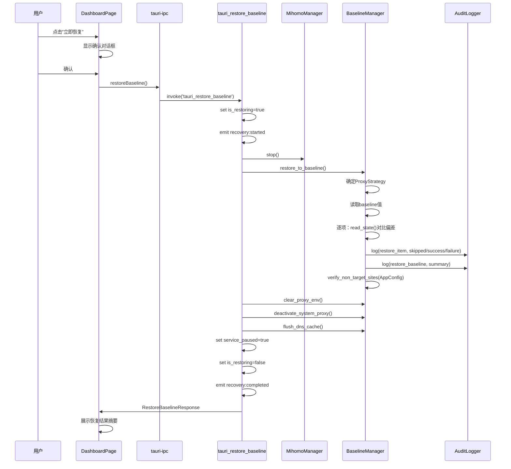

# Feature 109: Baseline 恢复语义修复 — 设计文档

- **Feature**: 109-baseline-restore-semantic-fix
- **阶段**: `hf-design`
- **状态**: 草稿（待用户评审）
- **日期**: 2026-06-08
- **上游规格**: `features/109-baseline-restore-semantic-fix/spec.md`
- **设计锚点**: `docs/principles/` 下 soul、sdd-artifact-layout、hf-sdd-tdd-skill-design

## 1. 设计目标

本设计修复 F001 baseline-restore 实现中的 2 个 P0 + 3 个 P1 + 4 个 P2 级设计-实现 gap。核心修复是：**"立即恢复"按钮从 `triggerReadjustment`（重启代理）改为真正的 `restore_to_baseline` 路径（停止代理 + 恢复所有 baseline 状态项）**。

## 2. 修改范围总览

| 修改编号 | 优先级 | 修改描述 | 涉及文件 |
|----------|--------|----------|----------|
| D-109-1 | P0 | "立即恢复"按钮改为调用 `stop_service` + `restore_to_baseline` | `DashboardPage.tsx`、`tauri-ipc.ts`、`baseline.rs` |
| D-109-2 | P0 | `wsl_remote.rs` 中 `wsl-proxy-env` 分类从 Restorable 改为 Excluded | `wsl_remote.rs` |
| D-109-3 | P1 | `restore_to_baseline()` / `stop_service()` 写入审计日志 | `baseline_manager.rs`、`baseline.rs` |
| D-109-4 | P1 | ProxyGuard 添加系统代理残留检查 | `proxy_guard.rs`、`baseline.rs` |
| D-109-5 | P1 | 非目标站点验证从硬编码改为读取 AppConfig | `baseline_manager.rs` |
| D-109-6 | P2 | Windows 端 `determine_proxy_address()` 通过 WslRemoteAdapter 感知 WSL 模式 | `baseline_manager.rs` |
| D-109-7 | P2 | 恢复后执行 DNS 缓存刷新 | `baseline_manager.rs` |
| D-109-8 | P2 | Mirrored 模式下恢复流程跳过 proxy-env 相关步骤 | `baseline_manager.rs`、`baseline.rs` |
| D-109-9 | P2 | 恢复前偏差确认——先对比再恢复 | `baseline_manager.rs` |
<!-- ? id:20;status:open;date:2026-06-09T15:00 spec §2.4 FR-2.4.1-R1描述的ProxyGuard系统代理残留检查明确指向Windows注册表(ProxyEnable=1)，但design §3.4的check_system_proxy_residual实现依赖baseline_mgr.read_current_system_proxy()，该方法在Linux端的行为未定义。需确认此P1修改是否仅限Windows平台，Linux端是否需要等价检查 -->

## 3. 详细设计

### 3.1 D-109-1: "立即恢复"语义修复

#### 3.1.1 问题根因

`DashboardPage.tsx:79` 中"立即恢复"按钮调用 `triggerReadjustment()`，该函数实现（`baseline.rs:471`）= `start_initial_assessment()`（重做评估），且 F108 commit 在此路径上加入了 `apply_proxy_env()` + `activate_system_proxy()`，使得实际行为是**重新开启代理服务**而非**恢复到 baseline**。
<!-- TODO id:10;status:open;date:2026-06-09T15:00 行号引用不精确——DashboardPage.tsx:65-69是按钮点击处理(handleRestoreClick)，:79是确认执行(handleConfirm)中调用triggerReadjustment()的位置。建议补充:65-69的行号引用以区分"点击"和"确认执行"两个步骤 -->

真正恢复到 baseline 的路径是 `stop_service()`（`baseline.rs:903-942`），它调用 `mihomo.stop()` + `restore_to_baseline()` + `clear_proxy_env()`。
<!-- TODO id:09;status:open;date:2026-06-09T15:00 行号引用不准确——baseline.rs:903-942是tauri_stop_service(Tauri command wrapper)，内部stop_service()函数在baseline.rs:544-559。引用应区分函数实现与command wrapper -->

#### 3.1.2 修复方案

**新增 Tauri command `tauri_restore_baseline`**，语义清晰，与 `triggerReadjustment` 分离：

```rust
// baseline.rs — 新增 command
#[tauri::command(rename_all = "snake_case")]
pub fn tauri_restore_baseline(
    state: tauri::State<'_, AppState>,
    app: tauri::AppHandle,
) -> Result<RestoreBaselineResponse, String> {
    check_not_restoring(&state)?;
    state.is_restoring.store(true, Ordering::Relaxed);

    // 1. Stop mihomo
    let mut mihomo = state.mihomo_manager.lock().expect("lock");
    let _ = mihomo.stop();
    drop(mihomo);

    // 2. Restore all Restorable items to baseline (with deviation check)
    let baseline_mgr = state.baseline_manager.lock().expect("lock");
    let restore_result = baseline_mgr.restore_to_baseline()
        .map_err(|e| command_error("Restore failed", e))?;

    // 3. Clear proxy-env (service lifecycle, F108)
    let _ = baseline_mgr.clear_proxy_env();

    // 4. Deactivate system proxy
    let _ = baseline_mgr.deactivate_system_proxy();

    // 5. Flush DNS cache
    let dns_flush_result = baseline_mgr.flush_dns_cache();

    drop(baseline_mgr);
    state.service_paused.store(true, Ordering::Relaxed);
    state.is_restoring.store(false, Ordering::Relaxed);
<!-- TODO id:11;status:open;date:2026-06-09T15:00 代码示例中.lock().expect("lock")在生产环境Mutex poison时会panic，应改为.lock().map_err(|e| format!("lock failed: {}", e))?。另外，步骤5(flush_dns_cache)属于P2-109-7(D-109-7)，但此处将其放入P0级tauri_restore_baseline命令中——P0和P2的交付批次需同步考量 -->

    // Emit events
    let _ = app.emit("recovery:completed", RecoveryCompletedPayload { ... });
    let _ = app.emit("service:stopped", ServiceStoppedPayload { ... });

    Ok(RestoreBaselineResponse {
        succeeded: restore_result.succeeded,
        failed: restore_result.failed,
        skipped: restore_result.skipped,  // 新增字段
        non_target_verification: restore_result.non_target_verification,
        dns_flushed: dns_flush_result.is_ok(),
    })
}
<!-- ? id:12;status:open;date:2026-06-09T15:00 RestoreBaselineResponse含dns_flushed字段，但DNS刷新(D-109-7)是P2级别。若P0先交付不含DNS刷新，该字段将始终为false，前端需处理此中间态。建议：P0交付时先不含dns_flushed字段，P2补齐时再扩展response -->
```

**UI 修改**：

```tsx
// DashboardPage.tsx
// handleConfirm 中 'restore' 分支改为：
if (confirmAction === 'restore') {
  await restoreBaseline();  // 新 IPC 调用
} else if (confirmAction === 'stop') {
  await stopService();
}

// 确认对话框文案：
// 'restore' → '将恢复到 Baseline 状态：停止代理服务并恢复所有网络设置。确认执行？'
// 'stop' → '停止服务将恢复到 Baseline。确认？'
```

**新增 IPC 函数**：

```ts
// tauri-ipc.ts
export async function restoreBaseline(): Promise<RestoreBaselineResponse> {
  return invoke('tauri_restore_baseline');
}
```

**新增 response 类型**：

```ts
// types.ts
export interface RestoreBaselineResponse {
  succeeded: number;
  failed: number;
  skipped: number;
  non_target_verification: NonTargetVerification | null;
  dns_flushed: boolean;
}
```

#### 3.1.3 `triggerReadjustment` 处置

`triggerReadjustment` 从仪表盘快捷操作区**移除**，仅在 WizardPage baseline 确认流程中保留（其语义为"重新评估"）。仪表盘不再展示该按钮。

#### 3.1.4 恢复后站点列表状态

恢复到 baseline 后，站点列表数据（`active_sites`）保留在内存中，但 mihomo 已停止，站点不再走代理。仪表盘展示：

```
服务状态: 已停止
Baseline 状态: 已确认（偏离: 0）
可达性摘要: 服务已停止，站点列表保留但未激活
```

> 注：`active_sites` 持久化是 F003 的范畴，本 feature 不处理。

### 3.2 D-109-2: WSL proxy-env 分类统一

#### 3.2.1 修改点

`wsl_remote.rs:263` 中 `ID_PROXY_ENV` 的 `category` 从 `StateItemCategory::Restorable` 改为 `StateItemCategory::Excluded`，description 与 `wsl.rs:190` 一致：

```rust
// wsl_remote.rs — 修改前
StateItemDefinition {
    id: ID_PROXY_ENV.to_string(),
    category: StateItemCategory::Restorable,
    description: "Proxy environment variables (http_proxy, https_proxy, no_proxy)".to_string(),
}

// wsl_remote.rs — 修改后
StateItemDefinition {
    id: ID_PROXY_ENV.to_string(),
    category: StateItemCategory::Excluded,
    description: "Proxy environment variables — managed by service lifecycle, not baseline".to_string(),
}
```

#### 3.2.2 影响分析

修改后，`restore_to_baseline()` 中 `.filter(|i| i.category == StateItemCategory::Restorable)` 不再包含 `wsl-proxy-env`，因此远程 WSL 场景下恢复不会尝试写回 proxy-env 值。这与本地 WSL 场景行为一致。

停止服务时的 `clear_proxy_env()` 不受影响——它通过 `write_proxy_env_values("", "", "")` 直接写入空值，不依赖 Restorable 分类。

### 3.3 D-109-3: 恢复流程审计日志

#### 3.3.1 修改点

在 `BaselineManager::restore_to_baseline()` 中，每个 Restorable 项恢复前后写入审计记录：

```rust
// baseline_manager.rs — restore_to_baseline() 内，恢复循环中添加：
for item_id in task.pending_items.iter().map(|i| i.state_item_id.clone()) {
    // ... existing restore logic ...

    match write_result {
        Ok(()) => {
            self.audit_logger.log(AuditRecord {
                action: "restore_item".to_string(),
                target: item_id.clone(),
                result: "success".to_string(),
                detail: Some(format!("restored to baseline value")),
                timestamp: chrono::Utc::now().to_rfc3339(),
            });
            // ...
        }
        Err(reason) => {
            self.audit_logger.log(AuditRecord {
                action: "restore_item".to_string(),
                target: item_id.clone(),
                result: "failure".to_string(),
                detail: Some(reason.clone()),
                timestamp: chrono::Utc::now().to_rfc3339(),
            });
            // ...
        }
    }
}

// 恢复完成后写入汇总审计记录
self.audit_logger.log(AuditRecord {
    action: "restore_baseline".to_string(),
    target: "all_restorable_items".to_string(),
    result: if failed == 0 { "success" } else { "partial_failure" }.to_string(),
    detail: Some(format!("succeeded={}, failed={}, skipped={}", succeeded, failed, skipped)),
    timestamp: chrono::Utc::now().to_rfc3339(),
});
```

#### 3.3.2 AuditLogger 传入方式

当前 `BaselineManager::new()` 接收 `audit_dir` 路径并内部创建 `RecoveryManager`。需要新增 `AuditLogger` 参数：

```rust
pub fn new(
    adapters: Vec<Box<dyn PlatformAdapter>>,
    storage: BaselineStorage,
    audit_dir: PathBuf,
    audit_logger: AuditLogger,  // 新增
) -> Self {
    Self {
        adapters,
        storage,
        audit_dir,
        audit_logger,  // 新增字段
    }
}
```

`AppState::new()` 中已有 `AuditLogger` 实例（`baseline.rs:390`），传入即可。
<!-- TODO id:13;status:open;date:2026-06-09T15:00 BaselineManager构造函数签名变更是breaking change——当前所有测试中的BaselineManager::new()调用需同步更新。design未提及测试迁移策略。建议：(1)为BaselineManager::new()提供默认AuditLogger（如NullAuditLogger）以减少测试改动量 (2)或在tasks阶段盘点受影响测试数量 -->

### 3.4 D-109-4: ProxyGuard 系统代理残留检查

#### 3.4.1 修改点

`ProxyGuard::check_and_recover()` 当前仅检查 mihomo 进程存活。新增系统代理残留检查：

```rust
// proxy_guard.rs — 新增方法
pub fn check_system_proxy_residual(
    &self,
    baseline_mgr: &BaselineManager,
) -> Option<SystemProxyResidual> {
    // 读取当前系统代理设置
    let current_proxy = baseline_mgr.read_current_system_proxy();
    // 如果 ProxyEnable=1 且 mihomo 进程不在运行，则为残留
    if current_proxy.proxy_enabled && !self.mihomo_is_running_hint {
        Some(SystemProxyResidual {
            proxy_server: current_proxy.proxy_server,
            baseline_proxy_enable: current_proxy.baseline_proxy_enable,
        })
    } else {
        None
    }
}
```

#### 3.4.2 实现策略

由于 ProxyGuard 当前只持有 `MihomoManager` 和配置，不持有 BaselineManager，修改方案为：

1. ProxyGuard 保持纯进程检查职责不变
2. 在 `proxy_guard_loop()` 回调中（`baseline.rs:1080-1126`），`check_and_recover()` 返回 `RecoveryTriggered` 后的恢复流程中，**先检查系统代理残留并立即恢复**

```rust
// baseline.rs — trigger_baseline_restore() 中，恢复前先清除系统代理残留
fn trigger_baseline_restore(state: &AppState, app: &tauri::AppHandle) {
    // ... existing restoring flag logic ...

    // NEW: Check and clear system proxy residual before full restore
    let baseline_mgr = state.baseline_manager.lock().expect("lock");
    let _ = baseline_mgr.deactivate_system_proxy();  // 立即清除系统代理
    let result = baseline_mgr.restore_to_baseline();
    // ... rest unchanged ...
}
```

这样避免了 ProxyGuard 持有 BaselineManager 的依赖问题，且保证"系统代理残留"在最早期就被清除（符合 FR-2.5.2-R4："检测到系统代理指向不可达服务时，必须立即恢复系统代理到 baseline 值"）。
<!-- TODO id:18;status:open;date:2026-06-09T15:00 proxy_guard_loop触发恢复时未检查is_restoring标志——若用户已通过仪表盘触发tauri_restore_baseline（is_restoring=true），proxy_guard_loop同时检测到mihomo不可达并触发trigger_baseline_restore，两个恢复流程将并发执行导致竞争。建议在trigger_baseline_restore入口增加check_not_restoring()守卫 -->

### 3.5 D-109-5: 非目标站点验证配置化

#### 3.5.1 修改点

`BaselineManager::verify_non_target_sites()` 当前使用硬编码 URL：

```rust
// baseline_manager.rs:316-319 — 当前
Some(Self::verify_non_target_sites(&[
    "https://www.baidu.com",
    "https://www.bing.com",
]))
```

改为从 AppConfig 读取：

```rust
// BaselineManager 新增 app_config 字段
pub struct BaselineManager {
    adapters: Vec<Box<dyn PlatformAdapter>>,
    storage: BaselineStorage,
    audit_dir: PathBuf,
    audit_logger: AuditLogger,
    app_config: AppConfig,  // 新增
}

// restore_to_baseline() 中
Some(Self::verify_non_target_sites(
    &self.app_config.non_target_probe_sites.iter().map(String::as_str).collect::<Vec<&str>>()
))
```

`verify_non_target_sites()` 签名不变（接受 `&[&str]`），只是数据来源从硬编码变为配置。

### 3.6 D-109-6: Windows 端 proxy 地址感知

#### 3.6.1 修改点

当前 `determine_proxy_address()` 仅 `#[cfg(target_os = "linux")]` 编译。Windows 端（Coordinated 模式）需要通过 WslRemoteAdapter 获取 WSL 状态。

```rust
// baseline_manager.rs — 修改后
pub fn determine_proxy_address(&self, mixed_port: u16) -> String {
    #[cfg(target_os = "linux")]
    {
        let detector = WslDetector::new(SystemFileReader);
        if detector.is_running_in_wsl() {
            match detector.detect_network_mode() {
                WslNetworkMode::Nat => {
                    if let Some(wsl_ip) = detector.get_wsl_ip() {
                        return format!("{wsl_ip}:{mixed_port}");
                    }
                }
                WslNetworkMode::Mirrored | WslNetworkMode::NotInstalled => {}
            }
        }
    }

    #[cfg(target_os = "windows")]
    {
        // Coordinated 模式下通过 WslRemoteAdapter 查询 WSL 网络模式
        for adapter in &self.adapters {
            if let Some(wsl_info) = adapter.get_wsl_network_info() {
                match wsl_info.network_mode {
                    WslNetworkMode::Nat => {
                        if let Some(ip) = wsl_info.wsl_eth0_ip {
                            return format!("{ip}:{mixed_port}");
                        }
                    }
                    WslNetworkMode::Mirrored => return format!("127.0.0.1:{mixed_port}"),
                    WslNetworkMode::NotInstalled => {}
                }
            }
        }
    }

    format!("127.0.0.1:{mixed_port}")
}
```

需要在 `PlatformAdapter` trait 中新增 `get_wsl_network_info()` 方法（默认返回 None，WslRemoteAdapter 实现返回实际值）。
<!-- ? id:14;status:open;date:2026-06-09T15:00 Windows端determine_proxy_address()仅在Coordinated模式下有意义（Windows主端+WSL从端），但当前代码无法判断是否处于Coordinated模式。需确认：(1)WslRemoteAdapter仅在Coordinated模式下被加载 (2)非WSL Windows场景（纯Windows部署）不应尝试获取WSL网络信息。design未提及Coordinated模式的判断逻辑 -->

### 3.7 D-109-7: 恢复后 DNS 缓存刷新

#### 3.7.1 新增方法

```rust
// baseline_manager.rs — 新增
pub fn flush_dns_cache(&self) -> Result<(), String> {
    #[cfg(target_os = "windows")]
    {
        let output = std::process::Command::new("ipconfig")
            .args(["/flushdns"])
            .output();
        match output {
            Ok(o) if o.status.success() => Ok(()),
            Ok(o) => Err(String::from_utf8_lossy(&o.stderr).to_string()),
            Err(e) => Err(e.to_string()),
        }
    }

    #[cfg(target_os = "linux")]
    {
        // 尝试 resolvectl，失败则尝试 systemd-resolve
        let output = std::process::Command::new("resolvectl")
            .args(["flush-caches"])
            .output()
            .or_else(|_| std::process::Command::new("systemd-resolve")
                .args(["--flush-caches"])
                .output());
        match output {
            Ok(o) if o.status.success() => Ok(()),
            Ok(o) => Err(String::from_utf8_lossy(&o.stderr).to_string()),
            Err(e) => Err(e.to_string()),
        }
    }

    #[cfg(not(any(target_os = "windows", target_os = "linux")))]
    Ok(())
}
```

DNS 刷新失败不阻塞恢复流程，但记入审计日志。

### 3.8 D-109-8: ProxyStrategy 与恢复流程集成

#### 3.8.1 修改点

在 `restore_to_baseline()` 开始前，查询当前 ProxyStrategy。如果为 `SkipConfig`（Mirrored 模式 + 可达），则跳过 proxy-env 相关恢复步骤。

```rust
// baseline_manager.rs — restore_to_baseline() 中
pub fn restore_to_baseline(&self) -> io::Result<RestoreResult> {
    // NEW: Determine ProxyStrategy for optimization
    let proxy_strategy = self.determine_current_proxy_strategy();

    // ... existing baseline loading ...

    // NEW: Filter items based on ProxyStrategy
    let pending: Vec<RecoveryItem> = baseline.items.iter()
        .filter(|i| i.category == StateItemCategory::Restorable)
        .filter(|i| {
            // In Mirrored SkipConfig mode, skip proxy-env related items
            if proxy_strategy == ProxyStrategy::SkipConfig
                && i.id.contains("proxy-env") {
                false
            } else {
                true
            }
        })
        .map(|i| RecoveryItem { ... })
        .collect();
}
```

新增 `determine_current_proxy_strategy()` 方法：

```rust
fn determine_current_proxy_strategy(&self) -> ProxyStrategy {
    #[cfg(target_os = "linux")]
    {
        let detector = WslDetector::new(SystemFileReader);
        if detector.is_running_in_wsl() {
            let mode = detector.detect_network_mode();
            // Simplified: assume reachable if mihomo is running
            return determine_strategy(&mode, true);
        }
    }
    ProxyStrategy::ExplicitConfig  // Default fallback
}
```
<!-- ? id:15;status:open;date:2026-06-09T15:00 "assume reachable if mihomo is running"是过度简化——WSL环境下mihomo运行不代表网络可达（如WSL网络完全依赖mihomo代理，mihomo运行但规则错误仍不可达）。建议：(1)传入mihomo_running状态而非硬编码true (2)或直接使用当前的WSL网络模式作为判断依据，不依赖可达性 -->
```

### 3.9 D-109-9: 恢复前偏差确认

#### 3.9.1 修改点

在 `restore_to_baseline()` 中，恢复每个 Restorable 项前，先通过 `adapter.read_state()` 采集当前值并与 baseline 值对比。一致则标记为 Skipped：

```rust
// baseline_manager.rs — restore_to_baseline() 内恢复循环修改
for item_id in task.pending_items.iter().map(|i| i.state_item_id.clone()) {
    let target_value = baseline_values.get(&item_id).expect("must exist");

    // NEW: Read current value and compare with baseline
    let current_value = self.read_current_value(&item_id);
    if current_value == Some(*target_value) {
        // Already matches baseline — skip
        recovery_mgr.complete_item(&item_id, ItemResult::Skipped, Some("already matches baseline"))?;
        skipped += 1;
        self.audit_logger.log(AuditRecord {
            action: "restore_item".to_string(),
            target: item_id,
            result: "skipped".to_string(),
            detail: Some("current value matches baseline, no change needed".to_string()),
            timestamp: chrono::Utc::now().to_rfc3339(),
        });
        continue;
    }

    // ... existing restore logic for items that deviate ...
}
```

新增 `read_current_value()` helper：

```rust
fn read_current_value(&self, item_id: &str) -> Option<serde_json::Value> {
    for adapter in &self.adapters {
        let defs = adapter.state_item_definitions();
        if defs.iter().any(|d| d.id == item_id) {
            return adapter.read_state(item_id).ok();
        }
    }
    None
}
```

需要在 `PlatformAdapter` trait 中新增 `read_state(item_id: &str) -> Result<serde_json::Value, String>` 方法。
<!-- TODO id:17;status:open;date:2026-06-09T15:00 read_current_value()对每个待恢复项遍历所有适配器查找匹配的state_item_definition，然后调用read_state()。若Restorable项有N个，适配器有M个，复杂度为O(N*M)。当前Restorable项通常≤10个，性能可接受，但建议在read_current_value()中缓存adapter→definitions的映射避免重复查找 -->

#### 3.9.2 RestoreResult 新增 skipped 字段

```rust
pub struct RestoreResult {
    pub task: RecoveryTask,
    pub succeeded: usize,
    pub failed: usize,
    pub skipped: usize,  // NEW
    pub non_target_verification: Option<NonTargetVerification>,
}
```

## 4. PlatformAdapter trait 扩展

本 feature 需要对 `PlatformAdapter` trait 新增两个方法：

```rust
// adapters/mod.rs — trait 扩展
pub trait PlatformAdapter: Send + Sync {
    fn state_item_definitions(&self) -> Vec<StateItemDefinition>;
    fn write_state(&self, item: &StateItem) -> Result<(), String>;

    // NEW: Read current state value for an item (used for deviation check)
    fn read_state(&self, item_id: &str) -> Result<serde_json::Value, String>;

    // NEW: Get WSL network info (used for proxy address on Windows side)
    fn get_wsl_network_info(&self) -> Option<WslNetworkInfo>;
}
```

`read_state()` — 各适配器已有 `collect_state()` 方法返回全量快照，可复用其内部采集逻辑按 item_id 过滤返回单值。

`get_wsl_network_info()` — 仅 `WslRemoteAdapter` 实现返回实际值，其余适配器返回 None。

```rust
// models — 新增
pub struct WslNetworkInfo {
    pub network_mode: WslNetworkMode,
    pub wsl_eth0_ip: Option<String>,
}
```
<!-- TODO id:16;status:open;date:2026-06-09T15:00 PlatformAdapter trait新增read_state()和get_wsl_network_info()两个方法。当前trait有4个实现（Windows/Linux/WSL/WslRemote），每个都需提供默认实现或具体实现。design未提及默认实现策略——建议trait提供默认fn read_state()返回Err("not supported")和fn get_wsl_network_info()返回None，减少适配器改动量 -->

## 5. 关键流程

### 5.1 "立即恢复"流程（修改后）



### 5.2 ProxyGuard 系统代理残留清除流程

```mermaid
sequenceDiagram
    participant PG as ProxyGuard
    participant Loop as proxy_guard_loop
    participant Baseline as BaselineManager

    PG->>PG: check_and_recover() → RecoveryTriggered
    Loop->>Baseline: deactivate_system_proxy() (立即清除)
    Loop->>Baseline: restore_to_baseline()
    Loop->>Loop: emit recovery:completed
```

## 6. 数据结构变更

| 结构 | 变更 | 说明 |
|------|------|------|
| `RestoreResult` | 新增 `skipped: usize` | 偏差确认后跳过的项数 |
| `RestoreBaselineResponse` | 新增类型 | UI 恢复结果展示 |
| `BaselineManager` | 新增 `audit_logger: AuditLogger`、`app_config: AppConfig` | 审计与配置来源 |
| `PlatformAdapter` trait | 新增 `read_state()`、`get_wsl_network_info()` | 偏差确认与 Windows 端 WSL 感知 |
| `WslNetworkInfo` | 新增类型 | WSL 网络信息传递 |

## 7. 不修改的内容

- `triggerReadjustment` 函数本身保留（WizardPage 中仍需使用）
- `stop_service()` Tauri command 保留（"停止服务"按钮仍可用）
- baseline 数据格式不变（backward compatible）
- `active_sites` 持久化不在本 feature 范围
- 启动续跑不在本 feature 范围（需单独 feature）

## 8. 风险雷达

| 风险 | 影响 | 概率 | 缓解措施 |
|------|------|------|----------|
| `read_state()` 实现复杂度 — 各适配器需逐项实现读取 | 中 | 中 | 复用 `collect_state()` 的内部采集逻辑，按 item_id 过滤返回 |
| Windows 端 `determine_proxy_address()` 需 WslRemoteAdapter 持有 WSL 检测能力 | 中 | 低 | WslRemoteAdapter 已通过 SSH 执行远程命令，新增 `get_wsl_network_info()` 成本可控 |
| DNS 刷新在某些 Linux 发行版可能无 `resolvectl` | 低 | 中 | 双路径 fallback（resolvectl → systemd-resolve），失败不阻塞 |
| `RestoreResult.skipped` 字段新增可能导致既有测试断言失败 | 低 | 低 | 测试中新增 `skipped: 0` 断言即可 |
| 审计日志写入失败可能中断恢复流程 | 高 | 低 | 审计写入失败只 log warning，不阻塞恢复主流程 |
<!-- TODO id:19;status:open;date:2026-06-09T15:00 风险雷达缺少两项关键风险：(1)恢复流程重入——proxy_guard_loop与用户手动恢复可能并发执行（参见标注id:18） (2)BaselineManager构造函数签名变更为breaking change，所有现有单元测试的BaselineManager::new()调用需同步更新，工作量未评估 -->

## 9. 测试策略

### 9.1 单元测试

| 测试项 | 覆盖需求 | 优先级 |
|--------|----------|--------|
| `tauri_restore_baseline` 调用 `mihomo.stop()` + `restore_to_baseline()` | FR-2.1.1-R1 | P0 |
| `wsl_remote.rs` 中 `wsl-proxy-env` category = Excluded | FR-2.2.1-R1 | P0 |
| `restore_to_baseline()` 中每个恢复动作写入审计记录 | FR-2.3.1-R1 | P1 |
| `verify_non_target_sites()` 使用 AppConfig URLs | FR-2.5.1-R1 | P1 |
| `restore_to_baseline()` 偏差确认——一致项标记 Skipped | FR-2.9.1-R1 | P2 |
| `flush_dns_cache()` Windows/Linux 路径 | FR-2.7.1-R1 | P2 |

### 9.2 集成测试

| 测试项 | 覆盖需求 |
|--------|----------|
| WSL NAT 场景："立即恢复" → mihomo 已停、系统代理已清、proxy-env 已清 | SC-1, SC-2 |
| Windows Coordinated 场景：`determine_proxy_address()` 返回 WSL eth0 IP | SC-6 |
| 恢复后 DNS 缓存已刷新 | SC-7 |

### 9.3 E2E 验证（手动）

| 验证项 | 步骤 |
|--------|------|
| "立即恢复"按钮语义正确 | ① 启动 mihomo → ② 确认 baseline → ③ 点击"立即恢复" → ④ 验证 mihomo 进程不存在 → ⑤ 验证系统代理 ProxyEnable=0 |
| 恢复结果展示 | 恢复完成后 UI 展示成功/失败/跳过项数 |