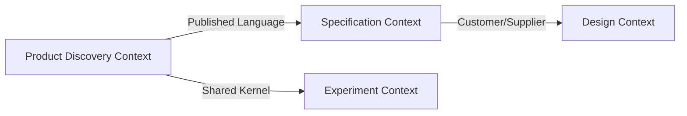

# DDD 战略建模参考（Bounded Context / Ubiquitous Language / Context Map）

## Purpose

本参考把 **Eric Evans** *Domain-Driven Design* 的**战略**部分（不含战术层的 Entity / Value Object / Aggregate 细节）作为 `hf-design` 上游的**可选结构化骨架**，用来：

- 在进入 C4 / 架构视图之前，先锁定**领域边界**与**统一语言**
- 把 spec 中的 section 14 术语表演化为 Ubiquitous Language 的 design 侧入口
- 为后续 `hf-tasks` / `hf-test-driven-dev` 提供稳定的语义锚点

战略建模的目标是**让边界正确**，不是画漂亮的图。规模不匹配的项目（单模块、明确脚本、纯 CLI 小工具）可以直接跳过本参考，在 design 文档中显式标注"本轮不做战略建模"。

## One-Line Rule

**边界先于结构**：先回答"哪些事属于一起、哪些不属于"，再回答"怎么画模块"。

## 三件核心产物

### 1. Bounded Context 清单

每个 Bounded Context 至少写出：

| 字段 | 含义 | 约束 |
|---|---|---|
| **Name** | 上下文名，采用 Ubiquitous Language 中的名词 | 不使用技术层名（例如 "service"、"module"） |
| **Purpose** | 这个上下文存在的原因 | 一句话，可回答"为什么要独立" |
| **Core Concepts** | 该上下文内的核心概念 | 3–7 个，避免大而全 |
| **Language** | 该上下文内与外部不同的术语 / 冲突词 | 显式列出冲突，避免"同名不同意" |
| **Ownership** | 谁维护这个上下文（团队 / 单人 / share） | 即使是 solo，也要写清 |

**规模控制**：discovery 级或 MVP 级项目通常只有 1–2 个 Bounded Context；超过 4 个时，先质疑是不是范围过大。

### 2. Ubiquitous Language 词表

- spec 中的 section 14 术语表 → design 阶段扩展为 Ubiquitous Language 的 design 侧入口
- 每个术语至少写：**所在 Bounded Context / 一句话定义 / 不允许的同义词 / 常见冲突**
- 术语出现在代码命名、ADR、任务描述、测试命名中，必须一致
- `hf-test-driven-dev` 阶段的测试命名、类 / 接口命名应与 Ubiquitous Language 对齐

最小示例：

```markdown
| 术语 | Bounded Context | 定义 | 禁用同义词 | 常见冲突 |
|------|-----------------|------|------------|----------|
| Discovery 草稿 | Product Discovery | 在尚未形成正式规格前，描述问题 / 用户 / 假设 / wedge 的可评审文档 | "初稿"、"想法文档" | 与 "spec 草稿" 不同，不可混用 |
| 规格草稿 | Specification | 已收敛到可交 hf-spec-review 的 FR/NFR 文档 | "需求文档" | 与 discovery 草稿不同层 |
```

### 3. Context Map

描述多个 Bounded Context 之间的关系，最少使用以下 DDD 经典模式中的 1–3 种（Evans）：

| 模式 | 含义 | 典型场景 |
|---|---|---|
| **Shared Kernel** | 两个上下文共享一小块模型，必须同步演进 | 共享术语表或共享协议 |
| **Customer / Supplier** | 下游依赖上游，双方合作定义契约 | 稳定的内部服务依赖 |
| **Conformist** | 下游无议价权，被动跟随上游 | 使用外部固定 API |
| **Anticorruption Layer (ACL)** | 在边界处翻译外部模型，保护自己不被污染 | 对接遗留系统 / 外部 SaaS |
| **Open-Host Service** | 以公开协议对外暴露 | 公共 API |
| **Published Language** | 围绕协议定义统一语言 | 跨团队协议 |
| **Separate Ways** | 两侧不共享，不集成 | 完全独立功能域 |
| **Partnership** | 两个上下文必须一起成功 | 核心域协作 |

**Context Map 不是架构图**：它回答"哪些边界需要翻译 / 哪些共享 / 哪些完全独立"，不画部署拓扑。

推荐用 Mermaid 表达：



## 与 spec 的衔接

- spec 的 Section 14 术语 → 作为 Ubiquitous Language 的初始种子
- spec 的 Key Hypotheses 中涉及"边界 / 集成 / 外部依赖"的假设，应在本参考对应的 Context 条目中显式回指
- spec 中的 CON / IFR（约束 / 外部接口）→ 通常会生成一条 Context Map 关系

## 与 C4 / 架构视图的衔接

DDD 战略建模的产物**不替代** C4，但是为 C4 提供边界输入：

- C4 的 Container / Component 视图应当能按 Bounded Context 切分，不允许一个 Container 横跨多个核心 Context（除非显式标为 Shared Kernel）
- 若 C4 视图出现"一个模块里住着多个 Context 的核心概念"，说明战略建模需要回修

## 何时跳过

以下场景允许在 design 文档中显式写"本轮不做战略建模"：

- 单模块小工具（脚本、CLI 小封装、一次性迁移）
- 仓库里只有 1 个 Bounded Context 且已长期稳定
- 主题纯属运维 / DX / 工程设施（无明显领域概念）

跳过时仍需保留一小节解释"为什么不做"，而不是沉默省略。

## 规模控制

- Bounded Context：1–4 个；超过时回到 spec 质疑范围
- Ubiquitous Language：先覆盖**跨 Context 容易歧义**的术语；单一 Context 内部可后续补
- Context Map：只画当前轮真实存在的关系，不画"未来可能有"

## 常见 Red Flag

- Bounded Context 的 Name 用了 "XxxService" 这样的技术词
- Ubiquitous Language 只是抄了一遍 spec 术语表，没有在 design 阶段澄清冲突
- Context Map 变成了部署拓扑图
- 模块 / 组件切分和 Bounded Context 不一致，但 design 没有解释
- 战略建模超过 6 个 Context，却没人能解释为什么要这么多

## 衔接

- 战略建模锁定 Bounded Context 之后，每个 Context **内部**的建模见 `ddd-tactical-modeling.md`（战术层 Aggregate / VO / Repository / Domain Service / Application Service / Domain Event）
- Event-flow 视角的补充见 `event-storming.md`
- NFR 向设计承接的 QAS 映射见 `nfr-checklist.md`（Phase 0 扩展版）
- 风险与可逆性决策仍由 ADR 承载（见 `adr-template.md`）
- 前置 / emergent 模式分工立场见 `docs/principles/emergent-vs-upfront-patterns.md`
