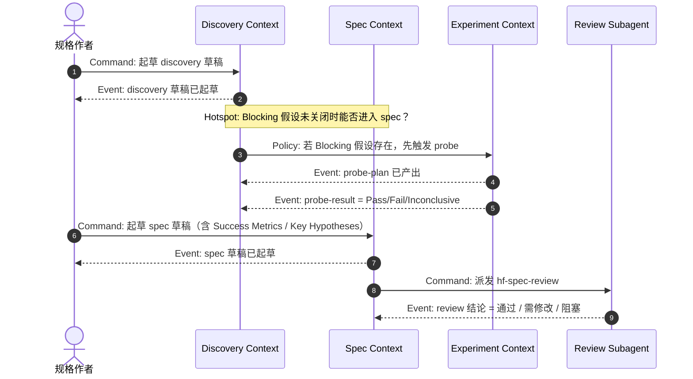

# Event Storming 参考（spec → design 的桥梁）

## Purpose

本参考把 **Alberto Brandolini** 的 **Event Storming** 作为 `hf-specify` 与 `hf-design` 之间的**桥梁方法**：在 spec 已批准、即将进入 design 之前（或 design 早期），用事件视角把业务流程与系统行为**先摊开**，再进入 Bounded Context 划分与 C4 视图设计。

它不是独立节点，也不是强制形式。只要 design 文档能冷读出"关键事件 / 命令 / 策略 / 异常流"，就算符合 Event Storming 最小契约。在小范围项目中，一次 15–30 分钟的桌面 / Mermaid Event Storming 就足够。

## One-Line Rule

**先澄清"发生了什么"，再谈"谁负责"**。

## 三档深度

按 `hf-design` 对应的 profile，Event Storming 分三档：

| profile | 使用档 | 最少产物 |
|---|---|---|
| `lightweight` | 可跳过 | 在 design 文档中写一段"主要事件 / 命令 / 异常流"的自然语言概述 |
| `standard` | Big Picture | 关键事件时序列（Event Timeline），含主要异常路径 |
| `full` | Big Picture + Process Modeling | Event Timeline + 命令 / 策略 / Read Model / 外部系统 + 热点标记 |

即便 `lightweight`，也不允许完全沉默；一段自然语言的事件叙述是最低要求。

## 基本符号（按需要精细化）

| 符号 | 含义 | 颜色约定（若视觉化） |
|---|---|---|
| Domain Event | 过去时态，表示"已经发生的业务事实" | 橙色 |
| Command | 触发事件的动作（现在时 / 祈使句） | 蓝色 |
| Actor | 发起 Command 的人 / 系统 | 黄色 |
| Policy | 一个事件之后自动触发的规则 | 紫色 |
| Read Model | 为决策提供信息的视图 | 绿色 |
| External System | 外部依赖 | 粉色 |
| Hotspot | 争议 / 不清楚 / 需要澄清 | 红色 |

在仓库里，允许简化为**纯文字**或 **Mermaid 序列**；不强制使用便签纸。

## Mermaid 模板（Big Picture 档）

## 与 Bounded Context / C4 的衔接

Event Storming 的输出要能**直接输入** `ddd-strategic-modeling.md` 与 C4 视图：

- 事件聚类 → 候选 Bounded Context 的边界（事件聚集在一起的区域很可能是同一 Context）
- 命令与外部系统交互点 → C4 Component / Container 视图的关键交互
- Hotspot → ADR 候选决策点（见 `adr-template.md`）
- Read Model → spec 中 FR / NFR 的验证视角

## 常见 Red Flag

- 事件写成了实现语言（"调用 REST API"，而不是"申请已提交"）
- 把 Command 和 Event 合在一起（"提交申请"是 Command，"申请已提交"才是 Event）
- 所有流程只画 happy path，异常流 / Hotspot 完全缺失
- Event Storming 图和 design 文档内的 Bounded Context / C4 不一致
- Event Storming 被画成 sequence diagram 的别名（只记交互，不记业务事件）

## 何时跳过

- `lightweight` profile 下，允许用一段自然语言描述替代正式图
- 项目只有单个简单流程、且该流程在 spec 中已写清（无异常流 / 无多角色协作）
- 领域模型完全清晰且无歧义时（例如对接固定第三方 API 的 thin wrapper）

跳过时在 design 文档中显式标注"本轮未做 Event Storming，因 <原因>"。

## 衔接

- 领域边界与 Ubiquitous Language 见 `ddd-strategic-modeling.md`
- 关键决策用 ADR 记录见 `adr-template.md`
- 架构视图仍按 C4 分层；Event Storming 是 C4 的上游输入，不是替代
